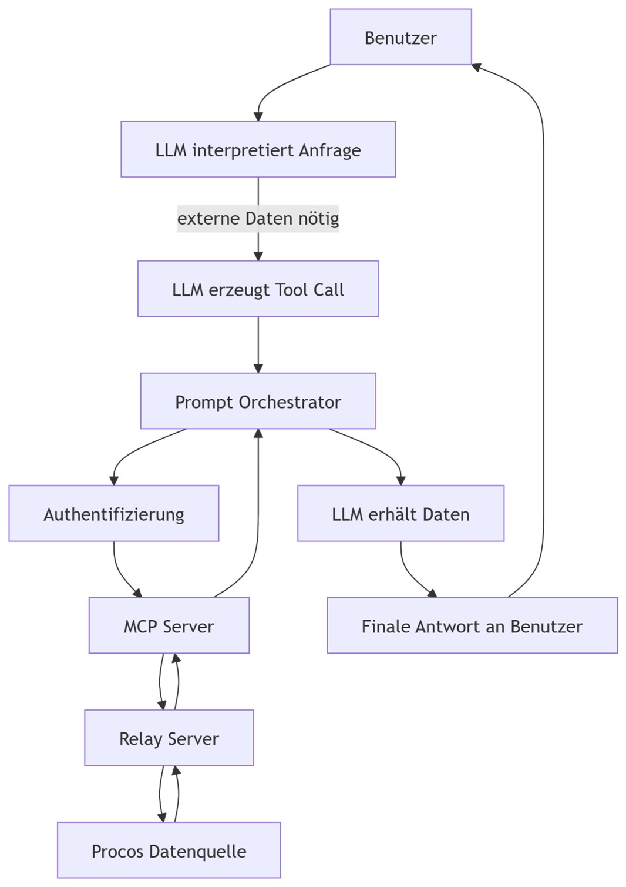

=== LLM interpretiert Benutzeranfrage

•	Der Benutzer stellt eine Anfrage (z. B. „Zeige mir alle Procos Artikel mit Mindestbestand < 20“).
•	Das LLM verarbeitet die Anfrage und stellt fest, dass es dafür externe Daten benötigt.

=== LLM erzeugt Tool Call
Basierend auf der Anfrage generiert das LLM einen Tool Call, z. B.:
```JSON
{
"tool": "getProcosInventory",
"arguments": { "minStock": 20 }
}
```
Die Tool Calls werden vom LLM automatisch erstellt 

=== Prompt Orchestrator verarbeitet Tool Call

Der Prompt Orchestrator fungiert als Vermittler:

•	Er identifiziert den passenden Tool Endpunkt,
•	Überprüft Eingaben
•	Leitet den Tool Call über den MCP Client an den MCP Server weiter
•	Er kann zusätzliche Informationen hinzufügen (Kontext, System Prompts, Sicherheitsregeln).

=== Authentifizierung

Bevor der MCP Server Daten abrufen darf, wird eine Authentifizierung ausgeführt: +
Der Auth Flow stellt sicher, dass nur berechtigte Agenten auf Procos Daten zugreifen.

=== MCP Server führt Tool aus

Der MCP Server:

•	Nimmt den Tool Call entgegen
•	Identifiziert das richtige Tool (z. B. Tool A = Bestandsdaten, Tool B = Artikeldetails)
•	Führt die definierte Logik aus
•	MCP Server sind exakt dafür konzipiert, Tools bereitzustellen und externen Datenzugang zu ermöglichen (Filesystem, APIs, Datenbanken)

=== Zugriff auf Procos Datenquelle

•	Der MCP Server kommuniziert nun mit dem Relay Server. 
•	Dieser reicht die Anfrage einfach durch zu der Procos Datenquelle
•	Er führt Queries aus oder ruft Daten ab, die das Tool benötigt.

=== MCP Server sendet die Daten zurück

•	Antwort wird vom Relay Server an den MCP-Server direkt weitergereicht
•	von diesem an den Prompt/Tool Orchestrator zurückgegeben, z. B.:
```JSON
[
{ "article": "12345", "stock": 12 },
{ "article": "88641", "stock": 17 }
]
```

=== Rückkanal zum LLM
•	Das LLM erhält die Daten zurück und integriert sie in die Antwort
•	fasst sie zusammen
•	analysiert sie
•	erzeugt ggf. Folge Tool Calls, wenn benötigt
•	Die Rückgabe erfolgt im Fluss, wie auch in MCP Agent Architekturen beschrieben.

=== Finales Ergebnis für den Benutzer

Der Benutzer bekommt eine verständliche, verarbeitete Antwort, z. B.: +
„Es gibt 2 Artikel unter Mindestbestand: Artikel 12345 (12 Stück), Artikel 88641 (17 Stück).“

