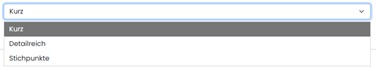
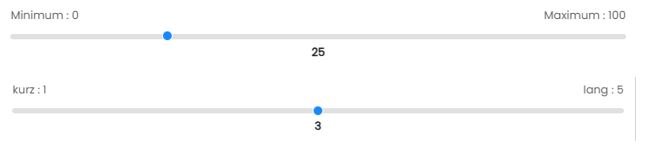

=== Aufbau und Erläuterung der einzelnen Punkte
Im Folgenden finden Sie die benötigten Informationen, den Aufbau und die Erläuterung der einzelnen zu spezifizierenden Punkte.

==== Beschreibung eines Anwendungsfalles 
Um Ihren Anwendungsfall optimal implementieren zu können, ist ein fundiertes Verständnis der Ziele und Hintergründe entscheidend. Eine sorgfältige Einleitung bzw. Beschreibung leistet hierzu einen wesentlichen Beitrag, da sie es uns ermöglicht, Zielsetzung, Rahmenbedingungen und den angestrebten Effizienzgewinn richtig einzuordnen. Diese Beschreibung wird nicht in {application} übernommen, sondern dient lediglich zu unserem Verständnis. +
Beschreiben Sie Ihren gewünschten Anwendungsfall deshalb möglichst präzise anhand der folgenden Überlegungen:

* In welchem Prozessschritt bzw. welche Zusammenhang möchten Sie diesen Anwendungsfall nutzen?
* Welches Ergebnis möchte ich haben, was erwarten Sie sich hiervon?
* In welcher Form soll das Ergebnis dargestellt werden?
* Welche Informationen möchte ich dem {application} mitgeben?

==== Name des Anwendungsfalles
Auf der Kachel wird der Titel des Standard-Anwendungsfalls angezeigt. In unserem Beispiel ist der Titel _„Angebotsvergleich“_.

image::Abbildung1.jpg[Kachel,title="Kachel", width=250]

==== Kurze Beschreibung, die auf der Kachel angezeigt wird
Auf der Kachel wird zudem eine kurze Beschreibung des Standard-Anwendungsfalls angezeigt. In unserem Beispiel ist die Kurzbeschreibung _„Vergleichen Sie Angebote mehrerer Lieferanten nach frei wählbaren Kriterien“_

==== Prompt und Varibalen / Felder
Für unser Beispiel wird folgender zentraler *System Prompt* genutzt:

_„Die angefragte Leistung umfasst bestimmte Positionen, die im Angebot enthalten sein sollen. Hierzu liegen einige Angebote von unterschiedlichen Anbietern vor, die du analysieren und vergleichen sollst. Bei der Analyse sollen bestimmte Kriterien eine besondere Gewichtung erhalten._

_Arbeite bitte die Unterschiede der Angebote aus und erstelle zum Abschluss eine Zusammenfassung ähnlich eines Management Summarys, in welchem die Unterschiede beschrieben und am Schluss eine Empfehlung mit einer entsprechenden Begründung erstellt wird, welches Angebot vorteilhaft ist und beauftragt werden soll.“_

Für unser Beispiel wird folgender zentrale *Persona* genutzt:
_"Stell dir vor, du bist ein erfahrener Einkäufer in deiner Branche, dabei ist deine Hauptaufgabe die Beschaffung."_

Für unser Beispiel wird auf Basis der Inhalte der definierten Varibalen / Felder aus dem Formular folgender *User Prompt* genutzt, der den Context des System-Pompts konkretisiert:

* Branche="Automobil"
* Beschaffung:"Reifen"
* Positionen der Leistungs:"Bezeichnung, Menge, Mengeneinheit"
* Angebote (Upload): Anbieter1.pdf, Anbieter2.pdf, Anbieter3.pdf
* Kriterin (Gewichtung): "Preis & Kostenstruktur, Lieferbedingungen, Qualität der Leistung, Anbieterbewertung"

Danach werden vom {application} der *System Prompt* inkl. *Persona* und der *User Prompt* verknüpft und als Einheit verwendet. 

Die meisten Standard-Anwendungsfälle bestehen überwiegend aus Textfeldern für die Eingabe der jeweiligen Variablen. +
Auch Kombinationen wie Text-Eingabe und daneben Datei-Uplaod sind denkbar. +
Hier werden einige Elemente angezeigt, wie sie im Formular eines Anwendungsfalles erscheinen.
[frame=all, grid=all, cols="1,3"]
|===
|Varibalen / Felder| Bild

|Text-Eingabe (mit Ausfüllhilfe)    |
|Auswahl-Feld	                    |
|Datei-Uplaod	                    |
|Schieberegler                      |
|===

==== Beispiel Angebotsvergleich für den Einkauf
Hier zeigen wir am Beispiel des Anwendungsfalls „Angebotsvergleich“ für den Einkauf, wie ein entsprechendes Eingabe Formular letztlich aussehen könnte. 

image::Abbildung2.jpg[Use Case ,title="Use Case", width=600]

=== Allgemeine Empfehlung zur Strukturierung der Prompts
Die Qualität der Ergebnisse ist abhängig von der Qualität des Prompts, der zentral hinterlegt ist. Um für alle Nutzer ein gleichbleibend gutes Ergebnis sicherzustellen ist es besonders wichtig, diesen zentralen Prompt gut auszuarbeiten und regelmäßig zu optimieren.

Allgemein ist die Struktur eines Prompts wichtig und wir empfehlen benötigte Aspekte deutlich zu beschreiben:
*Format:* +
_„Stelle die Antwort dar als [Liste/Tabelle/Fließtext/Code/Absatz/…].“_ +
*Details & Einschränkungen:* +
_„Achte darauf, dass [Länge, Ausschlüsse].“_ 

Allgemein ist die Struktur einer Persona wichtig und wir empfehlen sie deutlich zu beschreiben:
*Rolle/Identität:* +
_„Du bist ein(e) [Experte/Expertin, Rolle, Perspektive] mit 15 Jahren Erfahrung in [Themengebiet].“_ +
*Aufgabe/Ziel:* +
_„Deine Aufgabe ist es, [genaues Ziel oder gewünschte Ausgabe] zu erstellen.“_ +
*Details & Einschränkungen:* +
_"Deine Zielgruppe ist [Zielgruppe]."_ +
_"Dein Stil ist [Stil, Sprache, Tonalität,]."_

*Ein entsprechendes Beispiel wäre:* +
*Persona:* _„Du bist ein erfahrener Marketingberater für kleine Unternehmen._ +
_"Deine Aufgabe ist es, 5 Social-Media-Ideen für ein Café zu entwickeln, das junge Leute ansprechen will._ +
*Prompt*: _Stelle die Antwort dar als nummerierte Liste. Achte darauf, dass die Ideen kreativ, kostengünstig und leicht umsetzbar sind. Schreibe in kurzen Sätzen (max. 15 Wörter pro Punkt). Vermeide generische Tipps wie "poste regelmäßig".“_

