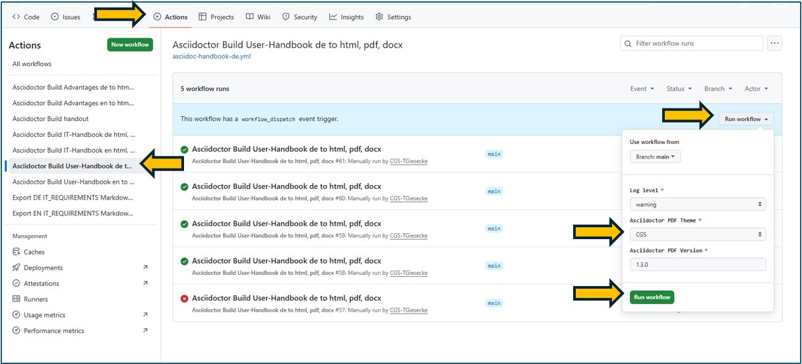

# Assist-user manuals

User manual in German and English.
Change these places from "CGS Assist" to "Arc Assist" or vice versa.

*Select the named action in GitHub for "de" or "en"*

Now click the related action to manually start the build.
Here you can choose the theme. Depending on the theme, some places will be replaced with different text.

After the run, the finished artifact can be downloaded here as a ZIP file.
The ZIP file contains files in PDF, HTML, DOCX and the image folder for html.

