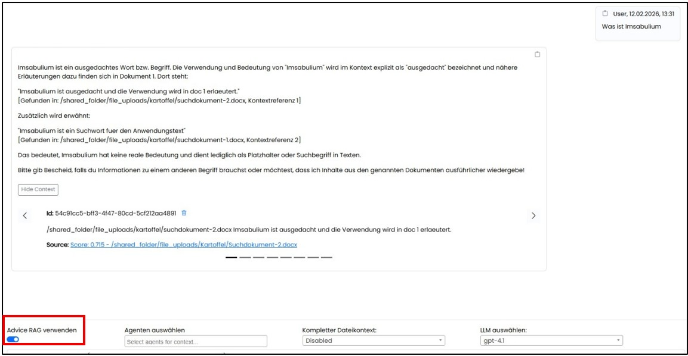
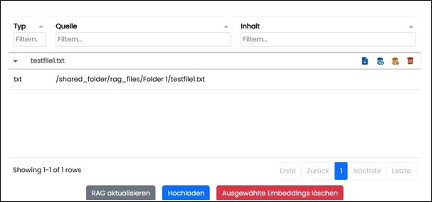

=== Assist Anwendung

==== Navigationsbereich "KI Chat"

Auf der Seite hat man eine klassische Chat Oberfläche mit einem Eingabefenster für Prompts. 
Alle Chatverläufe werden nur im Browser Storage gespeichert und sind nach dem Browser schließen 
(Wenn Einstellung "automatischem Cache leeren") und der Neuanmeldung nicht weiter verfügbar.
Alle gespeicherten Use Case Verläufe können auch nach dem Browser schließen und der Neuanmeldung wieder geöffnet werden.

Es kann vor dem Ausführen von Anfragen ausgewählt werden, ob die internen Inhalte des (RAG) z.B. aus dem Sharepoint oder 
der Datenbank *zusätzlich* zur Wissensfindung durchsucht werden sollen. 

Die Berechtigungen auf Ordner und enthaltene Dokumente werden bei der Suche über das RAG berücksichtig.
Nutzt man das RAG werden bei der Antwort die Top 8 Embeddings für die Antwort und ein Link zur jeweiligen Quelle angezeigt. 
Somit kann mit einem Klick die Antwort in der originalen Quelle verifiziert werden.

Im Chateingabefeld werden bereits verwendete Zeichen gezählt und angezeigt. Zusätzlich ist eine automatische Rechtschreibkontrolle aktiviert.
Es bestehen die Möglichkeiten zur Anfrage über eine manuelle Texteingabe, über eine Sprachaufnahme per Mikrofon oder das Laden eines Dokumentes.

image::../images/Abbildung-38.jpg[Navigationsbereich KI Chat inputs, title="Navigationsbereich KI Chat inputs", width=400]

Die Inhalte lassen sich mit einem „Copy“ Button in der Zwischenablage speichern zur weiteren Verarbeitung.

image::../images/cgs-Abbildung-4.jpg[Navigationsbereich KI Chat  - speichern, title="Navigationsbereich KI Chat  - speichern", width=400]

Um einen Chat umzubenennen, kann der Edit Button (Stift) benutz werden.
Um einen Chat im linken Baummenü zu löschen, muss zuerst der Löschen Button betätigt werden und danach das Löschen mit Klick auf den Haken bestätigt werden.

image::../images/Abbildung-5.jpg[Navigationsbereich KI Chat  - löschen, title="Navigationsbereich KI Chat  - löschen", width=300]

==== Navigationsbereich "Anwendungsfälle" 

Hier werden alle aktivierten Anwendungsfälle, nach den Bereichen gruppiert, angezeigt. Die Zordnung der Anwendungsfälle zu den bereichen, erfolgt bei Anlage in der Administration.
Anwendungsfälle sind in der Administration hinterlegte und freigegebene Use Case Listen, die vor der Ausführung nur noch mit konkreten Inhalten zu befüllen sind. 
Diese Listen erleichtern routinemäßige Anfragen.

image::../images/Abbildung-6.jpg[Navigationsbereich Anwendungsfälle, title="Navigationsbereich Anwendungsfälle", width=400]

Zum Öffnen eines konkreten Anwendungsfalles wird auf das Symbol mit Namen geklickt.

image::../images/Abbildung-7.jpg[Navigationsbereich - Anwendungsfälle - Auswahl des Falles, title="Navigationsbereich - Anwendungsfälle - Auswahl des Falles", width=400]

Klick auf ein Symbol mit Namen öffnet den Anwendungsfall zur Datenaufnahme.

image::../images/Abbildung-8.jpg[Navigationsbereich - Anwendungsfälle - Auswahl des Falles, title="Navigationsbereich - Anwendungsfälle - Auswahl des Falles", width=400]

Hier werden bereits fertig hinterlegte Use Cases angezeigt, die mit Eingaben befüllt werden können. Anschließend kann die Abfrage durch Klick auf Ausführen“ abgeschickt werden.
Während der Verarbeitung wird eine Wait Box angezeigt und der Statusverlauf als Info angezeigt.

image::../images/Abbildung-9.jpg[Navigationsbereich - Anwendungsfälle - Waitbox, title="Navigationsbereich - Anwendungsfälle - Waitbox", width=400]

Nach der Rückmeldung zur Anfrage kann über einen Butten in den Navigationsbereich „Chat“ geöffnet werden, um auf diesen konkreten Use Case weitere Anfragen zu starten.
Das Ergebnis einer Anfrage kann auch gespeichert werden und ist dann als separater Chat verfügbar.
Um einen Use Case zu löschen, muss zuerst der Lösch Button betätigt werden und danach die Abfrage mit „OK“ bestätigt werden.

image::../images/Abbildung-11.jpg[Navigationsbereich - Anwendungsfälle - Löschen eines Falles, title="Navigationsbereich - Anwendungsfälle - Löschen eines Falles", width=400]

==== Navigationsbereich "Automatisierung"

Hier werden, bei vorhandener Berechtigung, alle automatisierten KI Agents gelistet und verwaltet. 
Diese Agents sind in der Administration festgelegt Anwendungsfälle die zur Automatisierung freigegeben wurden.
Die markierte Nummer (rot) zeigt die summierte Anzahl der aktuellen Ergebnisse das letzten Laufs aller Rubriken. 
Die Anzeige der Ergebnisse(rot) wird neu berechnet, wenn die Lesebestätigung von einem User in einer der Rubriken gesetzt wird.

include::part1-1-audit-methodology.adoc[]

include::part1-2-audit-execution.adoc[]

====  Navigationsbereich "Dokumente" 

Hier werden alle verfügbaren und durchsuchbaren Dokumente angezeigt, für die der Anwender mit seiner Rolle berechtigt ist.
Dabei kann die Dokumententabelle nach Dokumenttyp (pdf, excel etc.), nach Quelle (bspw. Netzwerklaufwerk oder Sharepoint) oder Inhalt gefiltert werden.
Da alle Dokumente mit Schlagwörtern verknüpft sind, kann man in Feld Inhalt nach beliebigen Schlagwörtern suchen, um die relevanten Dokumente zu finden.

image::../images/Abbildung-12.jpg[Navigationsbereich - Dokumente - Baum löschen, title="Navigationsbereich - Dokumente - Baum löschen", width=400]

In der Baumnavigation werden nur die Ordner gelistet, auf die der Anwender berechtigt ist. 
Die Zuordnung der Dokumente zu den jeweiligen Ordnern erfolgt in der Administration

image::../images/Abbildung-33.jpg[Navigationsbereich - Dokumente - Baumnavigation, title="Navigationsbereich - Dokumente - Baumnavigation", width=150]

Die Dokumente können über einen Button heruntergeladen werden und manuell die Ansicht aktualisiert werden. Über eine Hochlade-Funktion können neue Dokumente ins RAG hochgeladen, 
über den Refresh Button das RAG aktualisiert oder einzelne Dokumente gelöscht werden. Da es bei sehr vielen Dokumenten zu Zeitverzögerungen kommen kann,
 wurde ein Lazy-Loading implementiert. Dadurch können über das Reload Icon die einzelnen Embeddings, also Teildokumente, manuel nachgeladen werden. 
Im oberen Bereich befinden sich Filter- um die Anzahl zu begrenzen und Sortierungsmöglichkeiten nach Quelle, ID und Vorschau. Die Filterresultate aktualisieren 
sich bereits während der Eingabe. Über Icon können Dokumente und somit die Inhalte des RAG bearbeitet werden werden.

|===
|image:../images/Abbildung-34.jpg[Dokument herunterladen, width=30]| Dokument herunterladen
|image:../images/Abbildung-35.jpg[Embeddings laden, width=30]| Embeddings laden (einzeln nachladen)
|image:../images/Abbildung-36.jpg[Aus RAG-System entfernen (Dokument bleibt in der Ordnerstruktur gespeichert), width=30] | Aus RAG-System entfernen (Dokument bleibt in der Ordnerstruktur gespeichert)
|image:../images/Abbildung-37.jpg[Dokument endgültig löschen, width=30]| Dokument endgültig löschen
|===

Über einen Klick auf das Symbol vor der Dokument, können die Teildokumente angezeigt werden.

==== Navigationsbereich "Portal"

Hier werden alle vefügbaren Verlinkungen zu anderen Seiten oder Anwendungen angezeigt, für die der Anwender mit seiner Rolle berechtigt ist.

image::../images/Abbildung-40.jpg[Navigationsbereich - Portal, title="Navigationsbereich - Portal", width=400]

Mit einem Klick auf das Symbol, wird die Verknüpfung, je nach Browsereinstellung, in einen neuen Browsertab oder Fenster geöffnet.

