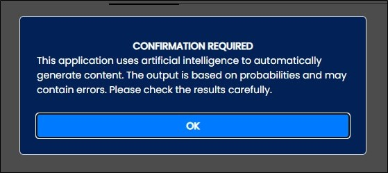
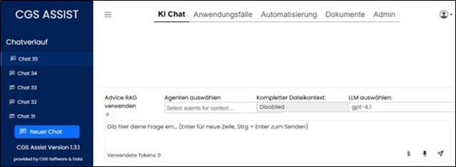
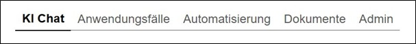
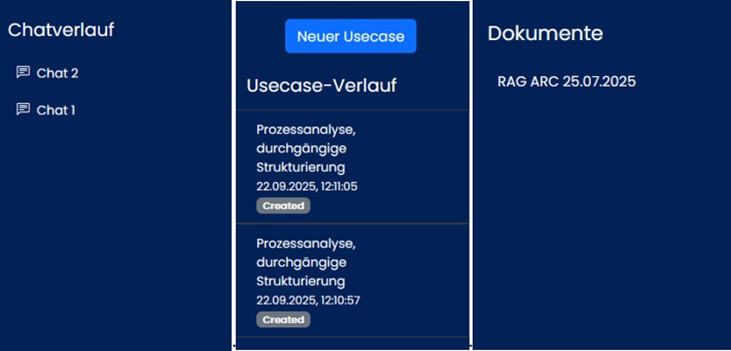
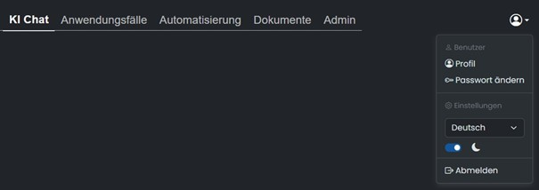
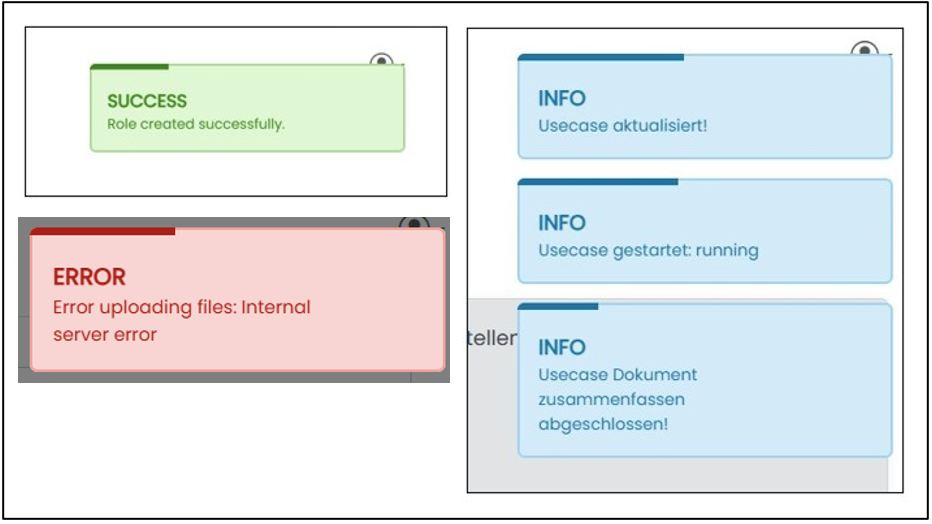

=== Anwendungsbeschreibung 

{application} bietet eine leistungsstarke KI‑Plattform, mit der Unternehmen ihr Wissen intelligent nutzen und in produktive Ergebnisse umwandeln können. Über spezialisierte Chats und vorkonfigurierte Use Cases erhalten Mitarbeitende schnellen und präzisen Zugriff auf relevantes Unternehmenswissen – basierend auf hinterlegten Dokumenten oder cloudbasierten Quellen. {application} ermöglicht eine mühelose Analyse komplexer Inhalte, die einfache Formulierung von Anfragen und eine effiziente Datenverarbeitung 

Bei der ersten Anmeldung wird der Nutzer darauf hingewiesen, dass die Anwendung künstliche Intelligenz zur automatischen Generierung von Inhalten verwendet. Da die Ausgabe auf Wahrscheinlichkeiten basiert und Fehler enthalten kann, wird der Nutzer gebeten, die Ergebnisse sorgfältig zu prüfen. Dieser Hinweis muss bestätigt werden, um {application} weiter nutzen zu können.

Bestimmte wiederkehrende Anwendungsfälle werden im {application} als Templates verwaltet, um Routinen zu vereinfachen. Diese Anwendungsfälle sind in Form von Checklisten angelegt. Bei entsprechender Berechtigung können mit Hilfe von KI‑Agents automatisierte Berichte, dynamische Auswertungen oder Prozesssteuerungen – auch über Systemgrenzen hinweg – genutzt werden.

ifeval::[{cgs-assist} == 1]

endif::[]

ifeval::[{arc-assist} == 1]
image::../images/arc-Abbildung-start.jpg[Arc Assist,title="Arc Assist", width=500]
endif::[]

Über eine Navigation am oberen Rand sind die thematisierten Navigationsbereiche erreichbar.
Je nach Berechtigungen des Anwenders können die Anzahl der Einträge bzw. das Design variieren.

Unterseiten dieser Navigationsbereiche sind dann jeweils über die Baumnavigation am linken Rand erreichbar.

Zusätzlich kann über ein Symbol am rechten oberen Rand die Auswahl der Sprache innerhalb der Anwendung getroffen werden und die Ansicht in den Dark Mode, bzw. wieder zurück, gewechselt werden. 
Auch können die Profildaten eingesehen werden bzw. eine Änderung des persönlichen Passwortes ist hier möglich.

Innerhalb der gesamten Anwendung werden bei Aktionen farbige Hinweisdialoge angezeigt:

* *grün* = Erfolgreiche Ausführung einer Aktion
* *blau* = Allgemeiner Hinweis über eine Aktion
* *rot* = Fehler bei der Ausführung einer Aktion

