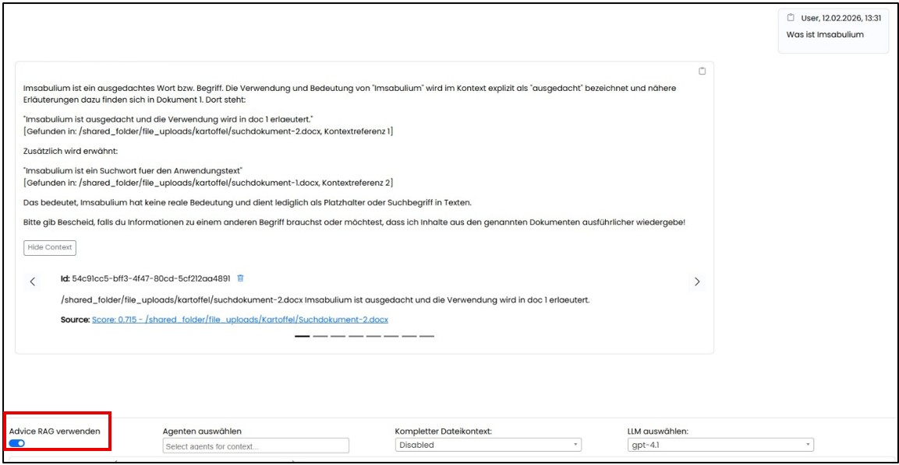
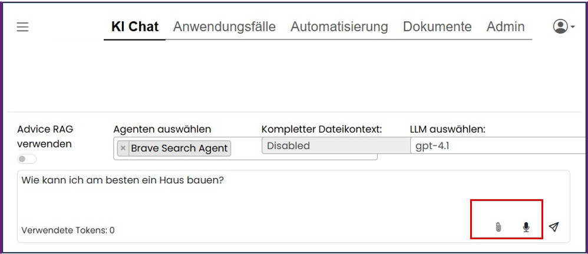
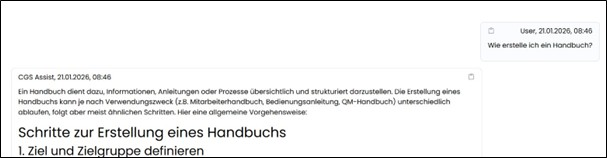
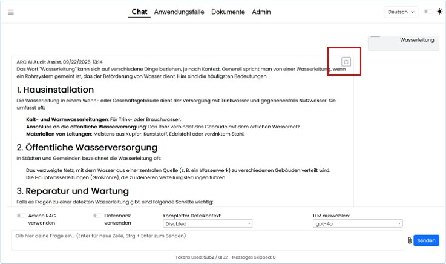
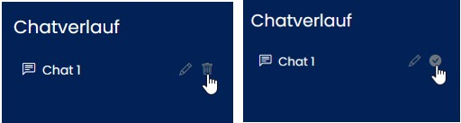

=== {application} Anwendung

==== Navigationsbereich "KI Chat"

Die Oberfläche bietet ein klassisches Chat‑Fenster mit Eingabefeld für Prompts. Alle Chatverläufe werden ausschließlich lokal im Browser gespeichert und sind – sofern die Einstellung „automatisches Cache‑Löschen“ aktiviert ist – nach dem Schließen des Browsers nicht mehr verfügbar. Gespeicherte Verläufe können dagegen auch nach einer Neuanmeldung wieder geöffnet werden.

Vor dem Ausführen einer Anfrage kann festgelegt werden, ob interne Inhalte aus dem RAG (z. B. SharePoint oder Datenbank) zusätzlich durchsucht werden sollen 

Über ein Dropdown‑Menü können verschiedene, meist kontextbezogene KI‑Agenten ausgewählt werden. Diese steuern granular, welche Aktionen die KI ausführen darf. Die KI kann ausschließlich auf die Daten zugreifen, die vom Agenten explizit freigegeben sind (z. B. nur suchen, nicht löschen).

Die Berechtigungen auf Ordner und enthaltene Dokumente werden bei der Suche über das RAG berücksichtig.
Nutzt man das RAG werden bei der Antwort die Top 8 Embeddings für die Antwort und ein Link zur jeweiligen Quelle angezeigt. 
Somit kann mit einem Klick die Antwort in der originalen Quelle verifiziert werden.

*Erlaubte Dokumente* sind  .pdf .docx .xlsx, .pptx, .txt.

Das Eingabefeld zeigt eine Zeichenzählung und verfügt über automatische Rechtschreibprüfung. Anfragen können per Texteingabe, Mikrofon oder über den Upload eines Dokuments gestellt werden.

Die Inhalte lassen sich mit einem „Copy“ Button in der Zwischenablage speichern zur weiteren Verarbeitung.

ifeval::[{cgs-assist} == 1]

endif::[]

ifeval::[{arc-assist} == 1]

endif::[]

Chats können per Copy‑Button kopiert, über den Stift umbenannt oder mit einer zweistufigen Bestätigung gelöscht werden.

