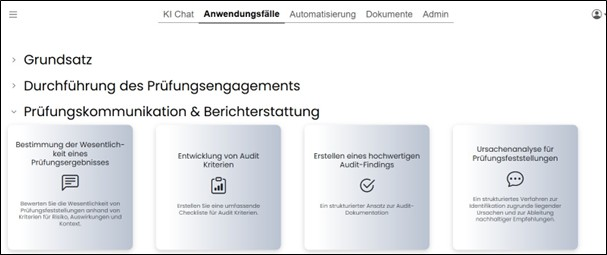
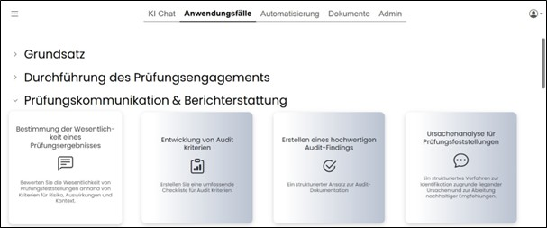
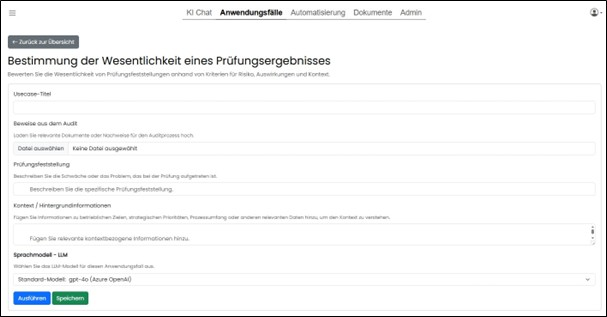
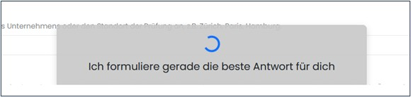
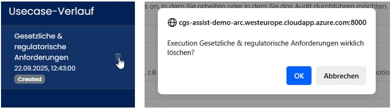

==== Navigationsbereich "Anwendungsfälle" 

Hier werden alle aktivierten Anwendungsfälle gruppiert angezeigt. Die Zuordnung zu Bereichen erfolgt in der Administration. Anwendungsfälle sind freigegebene Use‑Case‑Listen, die vor der Ausführung mit konkreten Eingaben befüllt werden.
Einige Anwendungsfälle können workflowbasiert angezeigt werden (z. B. erst Anwendungsfall 1, dann 2, sofern 1 abgeschlossen wurde).

*Erlaubte Dokumente* sind: .pdf .docx .xlsx, .pptx, .txt.

Zum Öffnen eines Anwendungsfalls wird auf das entsprechende Symbol geklickt. 

Anschließend können vorbereitete Use Cases mit Eingaben befüllt und durch „Ausführen“ gestartet werden. 

Während der Verarbeitung wird eine Wartebox mit Statusinformationen angezeigt.

Ergebnisse können gespeichert und als eigener Chat weitergeführt werden. Löschen erfolgt ebenfalls zweistufig.

