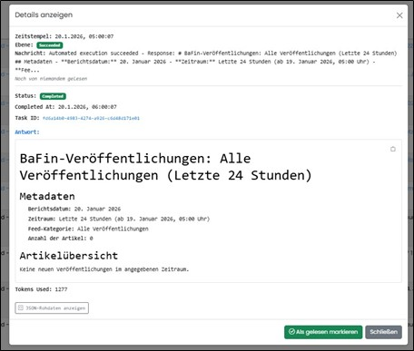

===== Grundsatz

In dieser Rubrik werden, bei vorhandener Berechtigung, alle automatisierten bereitgestellten Informationsquellen (Feeds) gelistet und verwaltet.
Die markierte Nummer (rot) zeigt die Anzahl der aktuellen Ergebnisse das letzten Laufs eines Feeds. Wird die Lesebestätigung von einem User gesetzt, 
wird die Anzeige der Neueingänge (rot) neu berechnet.

Folgende Feeds sind implementiert:

- BaFin Newsfeed (Letzte News und Neuerungen von BaFin)

image::../images/Abbildung-27.jpg[Navigationsbereich - Automatisierung, title="Navigationsbereich - Automatisierung - Feeds", width=500]

Zum Öffnen eine Feed wird auf das Symbol mit Namen geklickt.
In der Übersicht werden alle gespeicherten Zeitpläne dieses Feeds angezeigt. Es können hier neue Zeitpläne erstellt werden und vorhandene gelöscht werden.

image::../images/Abbildung-26.jpg[Navigationsbereich - Automatisierung - Zeitpläne, title="Navigationsbereich - Automatisierung - Feeds - Zeitpläne", width=150]

Im Bereich Ausführungsprotokolle werden alle Programmläufe gelistet. Über einen Button können die genauen Details angesehen werden.

image::../images/Abbildung-28.jpg[Navigationsbereich - Automatisierung, title="Navigationsbereich - Automatisierung - Feeds", width=500]

Die Lesebestätigung kann verschieden gesetzt werden. Wird die Lesebestätigung von einem User gesetzt, wird die Anzeige der neuen Feeds (rot) neu berechnet. 
Blau Schrift kennzeichnet einen ungelesenen Feed, Schwarz kennzeichnet einen gelesenen Feed. Jeder Leser kann den Eintrag als gelesen markieren oder ungelesen markieren.
Zusätzlich kann der Benutzer mit dem Button "Ich habe es auch gelesen" einen bereits von jemend als "gelesen" markierten Eintrag mit "von mir gelesen" kennzeichnen. 
Die Lesemarkierung kann in der Übersicht erfolgen oder im Detaildialog.

