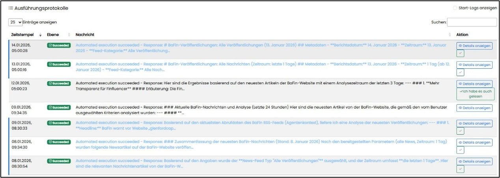
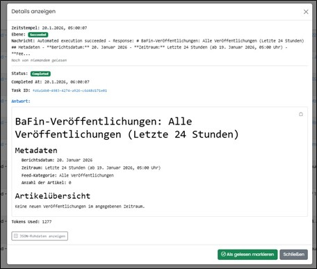

==== Navigationsbereich "Automatisierung"

Dieser Bereich zeigt – bei entsprechender Berechtigung – alle automatisierten Agenten‑Use‑Cases. Die rote Markierung zeigt die Gesamtzahl neuer Ergebnisse des letzten Laufs an; der Wert aktualisiert sich nach Setzen einer Lesebestätigung. 

Jeder Agenten‑Use‑Case kann zeitlich gesteuert werden (konkret oder periodisch). Ergebnisse und deren Details sind über die Ausführungsprotokolle einsehbar.

Ungelesene Einträge erscheinen blau, gelesene schwarz. Nutzer können Einträge als gelesen oder ungelesen markieren; zusätzlich kann „Ich habe es auch gelesen“ gesetzt werden.

