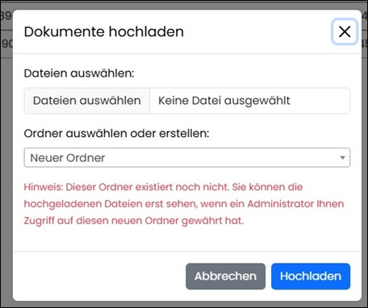

====  Navigationsbereich "Dokumente" 

Hier werden alle verfügbaren und durchsuchbaren Dokumente angezeigt, für die der Anwender mit seiner Rolle berechtigt ist.
Dabei kann die Dokumententabelle nach Dokumenttyp (pdf, excel etc.), nach Quelle (bspw. Dokumentname) oder Inhalt gefiltert werden.
Da alle Dokumente mit Schlagwörtern verknüpft sind, kann man in Feld Inhalt nach beliebigen Schlagwörtern suchen, um die relevanten Dokumente zu finden.

image::../images/Abbildung-12.jpg[Navigationsbereich - Dokumente - Baum löschen, title="Navigationsbereich - Dokumente - Baum löschen", width=400]

In der Baumnavigation werden nur die Ordner gelistet, auf die der Anwender berechtigt ist. Die Zuordnung der Dokumente zu den jeweiligen Ordnern erfolgt 
beim Upload oder bei der Erstellung von Ordnern über Upload.

Es werden immer alle Dokumente angezeigt. Beim Klick auf einen Ordner wird die Ansicht auf die Dokumente dieses Ordners reduziert. 
Wird erneut auf diesen Ordner geklickt, wird der reduzierte Inhalt wieder auf alle Dokumente zurück gesetzt.

image::../images/Abbildung-33.jpg[Navigationsbereich - Dokumente - Baumnavigation, title="Navigationsbereich - Dokumente - Baumnavigation", width=150]

Die Dokumente können über einen Button heruntergeladen werden und manuell die Ansicht aktualisiert werden. Über eine Hochlade-Funktion können neue Dokumente ins RAG hochgeladen, 
über den Refresh Button das RAG aktualisiert oder einzelne Dokumente gelöscht werden. Da es bei sehr vielen Dokumenten zu Zeitverzögerungen kommen kann,
 wurde ein Lazy-Loading implementiert. Dadurch können über das Reload Icon die einzelnen Embeddings, also Teildokumente, manuel nachgeladen werden. 
 
Beim Hochladen von Dokumenten muss ein Zeilordner ausgewählt oder mit Eingabe eines Bezeichners ein neuer Ordner erstellt werden. Beim Erstellen eines neuen Ordners wird der Anwender 
über einen roten Text darauf hingewiesen, das der neue Ordner noch keine Berechtigungen besitzt. Diese müssen in der Administration vergeben werden, damit der neue Ordner inklusive
Dokumente sichtbar ist.

 
Im oberen Bereich befinden sich Filter- um die Anzahl zu begrenzen und Sortierungsmöglichkeiten nach Quelle, ID und Vorschau. Die Filterresultate aktualisieren 
sich bereits während der Eingabe. Über Icon können Dokumente und somit die Inhalte des RAG bearbeitet werden werden.

|===
|image:../images/Abbildung-34.jpg[Dokument herunterladen, width=30]| Dokument herunterladen
|image:../images/Abbildung-35.jpg[Embeddings laden, width=30]| Embeddings laden (einzeln nachladen)
|image:../images/Abbildung-36.jpg[Aus RAG-System entfernen (Dokument bleibt in der Ordnerstruktur gespeichert), width=30] | Aus RAG-System entfernen (Dokument bleibt in der Ordnerstruktur gespeichert)
|image:../images/Abbildung-37.jpg[Dokument endgültig löschen, width=30]| Dokument endgültig löschen
|===

Über einen Klick auf das Symbol vor der Dokument, können die Teildokumente angezeigt werden.

image::../images/Abbildung-13.jpg[[Navigationsbereich - Dokumente - Teildokumente öffnen, title="[Navigationsbereich - Dokumente - Teildokumente öffnen", width=400]

