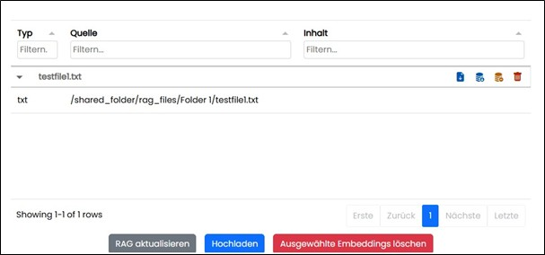
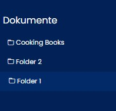
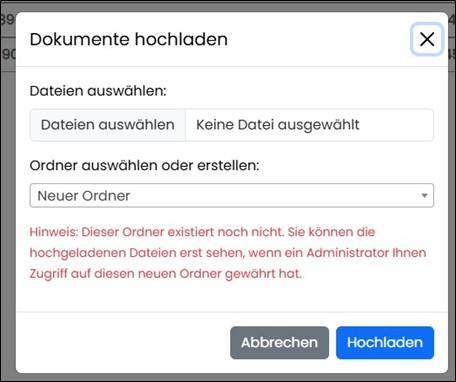
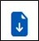

====  Navigationsbereich "Dokumente" 

Hier werden alle verfügbaren und durchsuchbaren Dokumente angezeigt, für die der Nutzer eine Berechtigung besitzt. Die Dokumenttabelle kann nach Dateityp, Quelle oder Schlagwörtern gefiltert werden.

Die Baumnavigation zeigt nur berechtigte Ordner. Ein Klick filtert die Liste auf Dokumente dieses Ordners, ein erneuter Klick hebt die Filterung auf.

Dokumente können heruntergeladen oder die Ansicht manuell aktualisiert werden. Neue Dokumente können hochgeladen und das RAG aktualisiert werden. Beim Hochladen vieler Dokumente kann es etwas Zeit in Anspruch nehmen. Dafür ist ein Lazy-Loading implementiert, sodass Embeddings auch einzeln aktualisiert werden können.

Beim Hochladen muss ein Zielordner gewählt oder ein neuer Ordner benannt werden. Neue Ordner haben zunächst keine Berechtigungen, diese müssen in der Administration vergeben werden.

 
Im oberen Bereich befinden sich Filter und Sortierungsmöglichkeiten nach Quelle, ID und Vorschau, um die angezeigte Anzahl zu begrenzen. Die Filterresultate aktualisieren sich bereits während der Eingabe.

*Symbole*:
|===
|| Dokument herunterladen
|image:../images/Abbildung-35.jpg[Embeddings laden, width=30]| Embeddings laden (einzeln nachladen)
|image:../images/Abbildung-36.jpg[Aus RAG-System entfernen (Dokument bleibt in der Ordnerstruktur gespeichert), width=30] | Aus RAG-System entfernen (Dokument bleibt in der Ordnerstruktur gespeichert)
|image:../images/Abbildung-37.jpg[Dokument endgültig löschen, width=30]| Dokument endgültig löschen
|===

Teildokumente (Vectorisierte Inhalte) können über einen Klick auf das Pfeilsymbol vor dem Dokument angezeigt werden.

image::../images/Abbildung-13.jpg[[Navigationsbereich - Dokumente - Teildokumente öffnen, title="[Navigationsbereich - Dokumente - Teildokumente öffnen", width=500]

