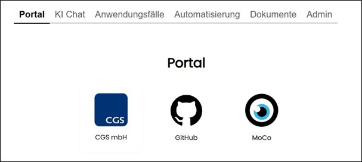

==== Navigationsbereich "Portal"

Dieser Bereich kann in der Administration aktiviert oder deaktiviert werden. Bei aktivierter Portal‑Seite werden alle freigegebenen Verknüpfungen zu anderen Anwendungen oder Webseiten angezeigt.

Ein Klick auf das Symbol öffnet die Verknüpfung, je nach Browsereinstellung, in einem neuen Browser‑Tab oder Fenster. +
Die Verlinkung lokaler Dateien oder Shares ist nicht möglich.

