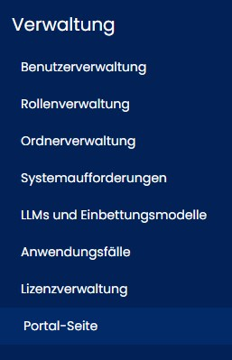
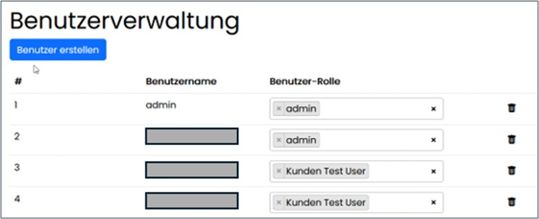

=== Assist Administration

Innerhalb der Administration können systemrelevante Daten zentral verwaltet werden: Benutzer, Rollen, Dokumentordner, Schnittstellenkonfigurationen, Systemaufforderungen (Prompts), Lizenzen sowie systemseitig hinterlegte Anwendungsfälle. +
Der Zugriff erfolgt über eine speziell zugewiesene Rolle.

==== Benutzerverwaltung

Die Benutzerverwaltung ist Abhängig von der Authentifizierungsmethod.

*OpenID Connect/SAML (Microsoft Entra ID)*

* Benutzer können *nicht* im Assist angelegt oder bearbeitet werden.
* Passwörter werden über Microsoft verwaltet.
* Rollenzuweisungen für Assist sind möglich.
* Entfernen von Benutzern aus der Oberfläche ist möglich, jedoch werden diese durch erneute Synchronisation ggf. wieder angezeigt.

*Lokale Benutzer-/Passwortverwaltung*

* Benutzer können angelegt und bearbeitet werden.
* Passwortverwaltung erfolgt im Assist.
* Rollen können zugewiesen werden.
* Entfernen erfolgt mit Sicherheitsabfrage.

