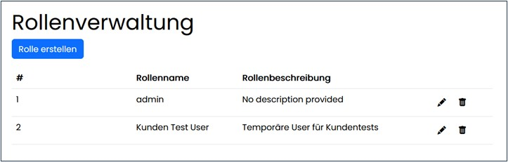
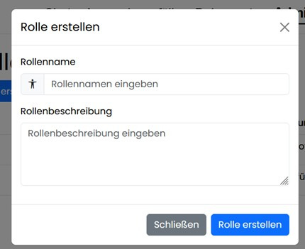

==== Rollenverwaltung

Hier werden Rollen angelegt und bearbeitet. Rollennamen müssen systemweit eindeutig sein, Beschreibungen können ergänzt und jederzeit geändert werden.

===== Rollen bearbeiten

Rollennamen müssen systemweit eindeutig sein, Beschreibungen können ergänzt und jederzeit geändert werden.

Rollen können nicht deaktiviert werden und sind nur über die Übersicht mit Sicherheitsabfrage entfernbar. Systemseitige Rollen sind nicht löschbar.

