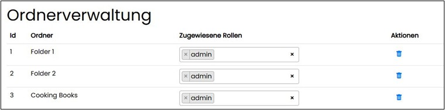

==== Ordnerverwaltung

Auf dieser Seite können den systemseitig angelegten Ordnern die Rollen zugewiesen werden. Damit wird der Zugriff auf diese Ordner unter Navigationsbereich „Dokumente“ gesteuert.
Ein Ordner entspricht in der Anwendung einem RAG (Retrieval Augmented Generation). Bei Retrieval Augmented Generation erweitert man den Prompt für das Large Language Model 
um die Suchergebnisse z.B. aus der Dokumentensammlung. Das Wissen für die Antwort kommt also aus den angebundenen Quellen.

Vom System erlaubte Dokumente zur Nutzung in der Ordnerverwaltung sind: .pdf .docx .xlsx, .pptx, .txt.

