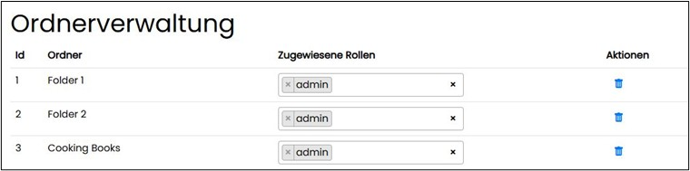
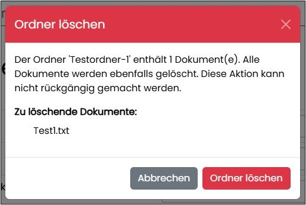

==== Ordnerverwaltung

Diese Seite zeigt alle Ordner an. Die Berechtigungen für Ordner werden über Rollen zugeordnet, wodurch die Sichtbarkeit im Bereich „Dokumente“ gesteuert wird.
Einzelne Ordner können, nach Bestätigung einer Sicherheitsabfrage, gelöscht werden. Im Ordner befindliche Dokumente werden mit gelöscht.

Im Dialog zur Sicherheitsabfrage werden die enthaltenen und mit gelöschten Dokumente aufgelistet.

*Erlaubte Dokumente* sind: .pdf .docx .xlsx, .pptx, .txt.

