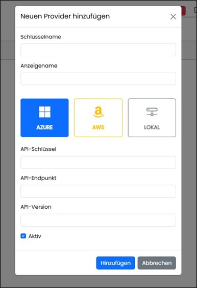
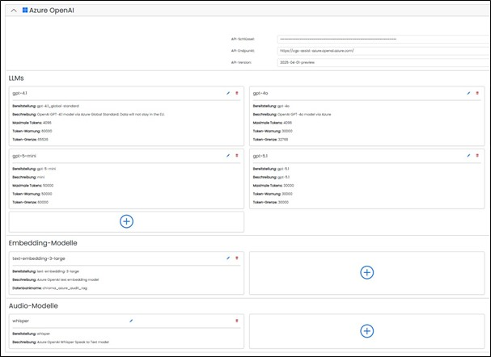
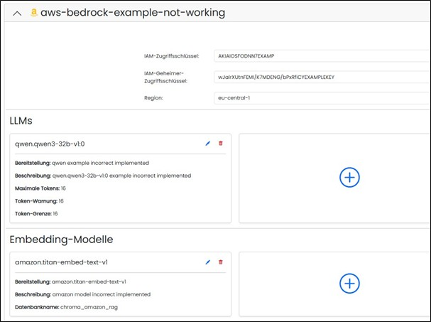
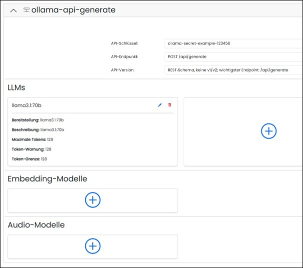

==== LLMs und Einbettungsmodelle 

Die Seite listet alle LLM‑Provider.

image::../images/Abbildung-22.jpg[Administration - LLMs und Einbettungsmodelle, title="Administration - LLMs und Einbettungsmodelle", width=600]

Neue Provider und Modelle können angelegt oder, nach einer Sicherheitsabfrage, wieder entfernt werden. Dabei kann vorausgewählt werden ob AWS, Azure oder lokaler Provider erstellt werden soll.
 

Über den Pfeil am linken Rand kann die Konfiguration geöffnet werden und die notwendigen Modelle können erstellt oder,
nach einer bestätigten Sicherheitsabfrage, auch entfernt werden.

