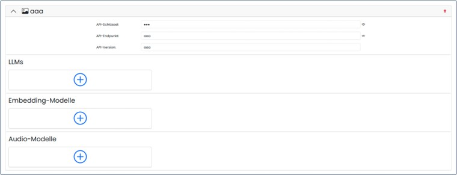

==== LLMs und Einbettungsmodelle 

Die Seite listet alle LLM‑Provider.

image::../images/Abbildung-22.jpg[Administration - LLMs und Einbettungsmodelle, title="Administration - LLMs und Einbettungsmodelle", width=500]

Neue Provider und Modelle können angelegt oder mit Sicherheitsabfrage entfernt werden.
 
image::../images/Abbildung-32.jpg[Administration - LLMs und Einbettungsmodelle - Provider anlegen, title="Administration - LLMs und Einbettungsmodelle - Provider anlegen", width=250]

Über den Pfeil am rechten Rand kann die Konfiguration geöffnet werden und die notwendigen Modelle können erstellt bzw. 
nach einer bestätigten Sicherheitsabfrage auch entfernt werden.

