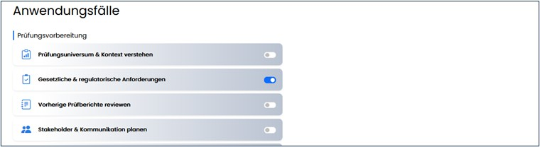
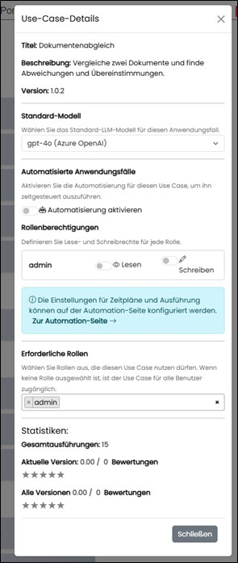

==== Anwendungsfälle

Hier werden Vorlagen für Anwendungsfälle verwaltet. Die Gruppierung ist systemseitig festgelegt.

Vorlagen können deaktiviert werden und steuern die Sichtbarkeit im Bereich „Anwendungsfälle“.

Anwendungsfälle können für die Automatisierung freigegeben und mit Berechtigungen versehen werden. Bewertungsstatistiken (Sterne) werden angezeigt.

