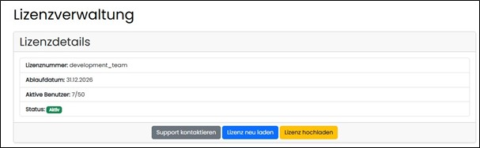
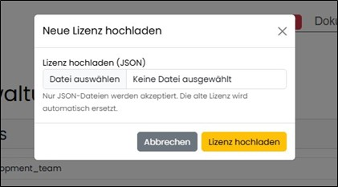

==== Lizenzverwaltung

Hier wird die Lizenz für den Assist verwaltet. Lizenzen können aktualisiert oder ersetzt werden. Ein Supportkontakt per Mail ist integriert.

Es kann nach Auswahl eine gänzlich neue Lizenz hochgeladen werden.

