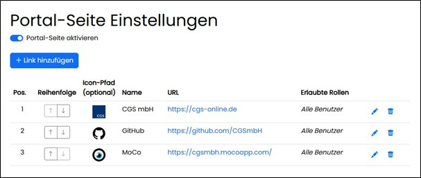
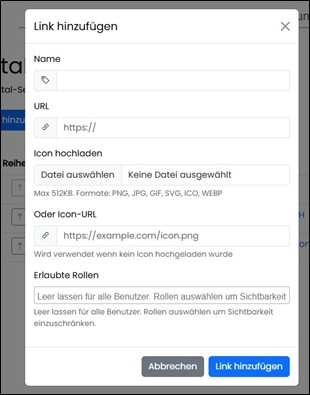

==== Portal-Seite

Verknüpfungen können erstellt, bearbeitet oder gelöscht werden. Berechtigungen steuern die Sichtbarkeit. Die gesamte Seite kann aktiviert/deaktiviert werden.

Es können Anwendungen oder Webseiten verknüpft werden; Dateien oder Laufwerks‑Shares sind ausgeschlossen.

