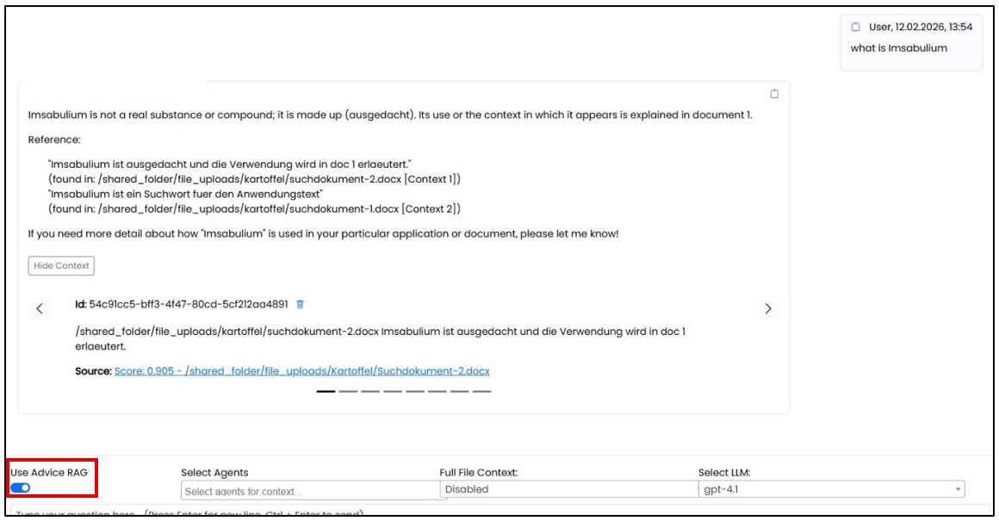
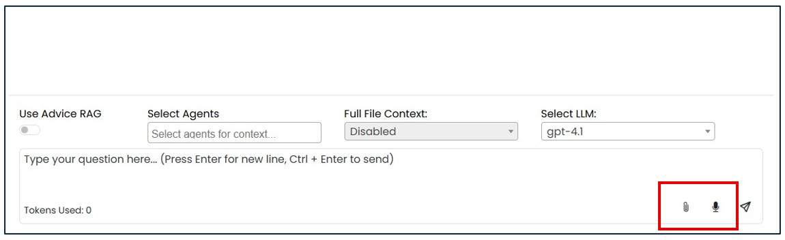
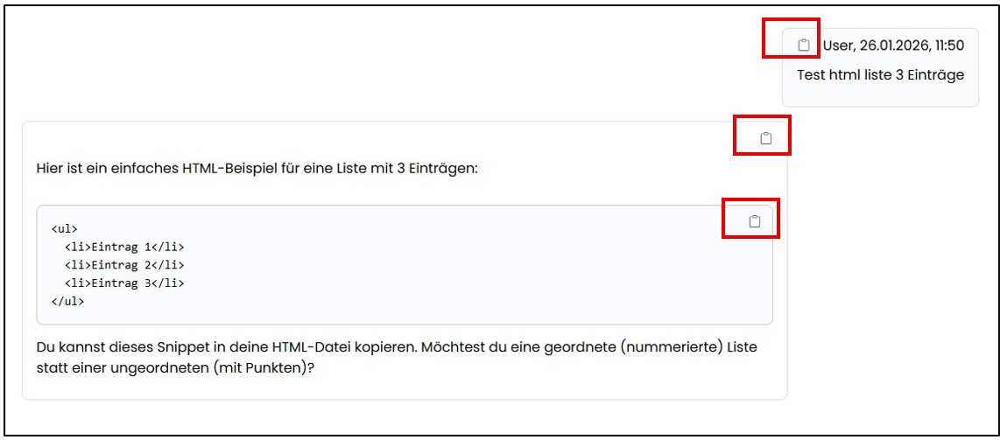
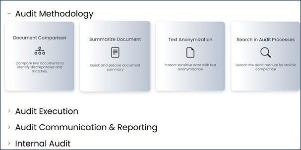
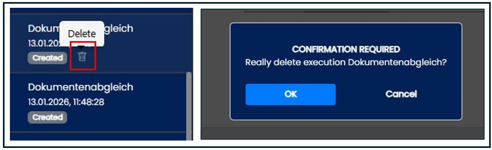
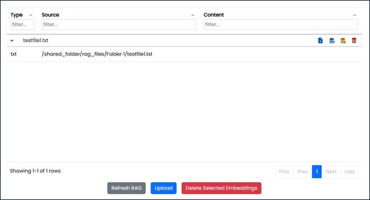
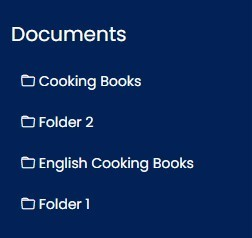
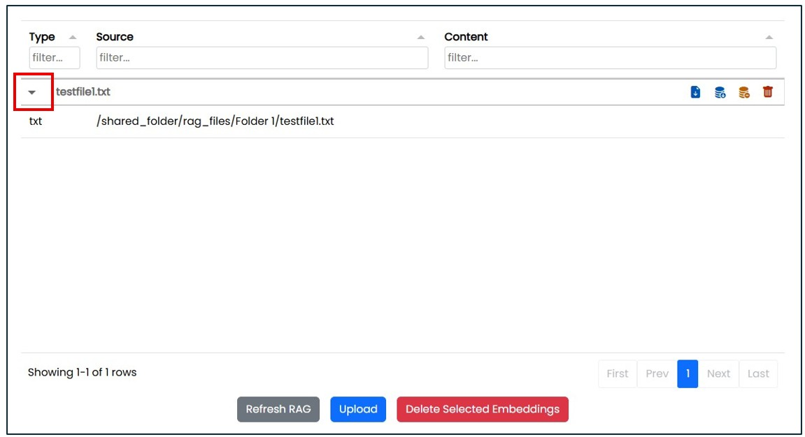

=== Assist Application

==== Navigation Area "AI Chat"

The page features a classic chat interface with a prompt input window. 
All chat histories are only saved in the browser storage and are no longer available after closing the browser 
(if the "automatic cache clearing" setting is enabled) and re-logging in.
All saved use case histories can be reopened even after closing the browser and logging in again.

Before executing request, you can select whether the internal contents of the (RAG) for example from SharePoint or the database should 
also be searched in addition to knowledge discovery.

Permissions on folders and included documents are taken into account when searching via the RAG.
When using the RAG, the answer will display the top 8 embeddings for the answer and a link to the respective source.
This allows the answer to be verified in the original source with a single click.

 
Additionally, an automatic spell checker is activated. You have the option to submit a request via manual text entry, 
via voice recording using a microphone, or by uploading a document.

The contents can be saved to the clipboard for further processing using a “Copy” button.

To rename a chat, the edit button (pencil) can be used.
To delete a chat in the tree menu on the left, the delete button must first be pressed and then the deletion confirmed by clicking the checkmark.

image::../images/Abbildung-5.jpg[Navigation area AI Chat - delete, title="Navigation area AI Chat - delete", width=300]

==== Navigation Area "Use Cases" 

All activated use cases are displayed here, grouped by area. The assignment of use cases to the areas takes place during setup in the administration.
Use cases are lists of use cases stored and approved in the administration, which only need to be filled with specific content before execution.
These lists facilitate routine requests.

To open a specific use case, click on the icon with the name.

image::../images/Abbildung-7.jpg[Navigation area Uses Cases - select one uses case, title="Navigation area Uses Cases - select one uses case", width=400]

Clicking on an icon with a name opens the use case for data entry.

image::../images/Abbildung-8.jpg[Navigation area Uses Cases - select one uses case, title="Navigation area Uses Cases - select one uses case", width=400]

Here, preconfigured use cases are displayed that can be filled with inputs. Afterwards, the query can be submitted by clicking "Execute".
During processing, a wait box is displayed and the status history is shown as information.

image::../images/Abbildung-9.jpg[Navigation area Uses Cases - Waitbox, title="Navigation area Uses Cases - Waitbox", width=400]

After receiving feedback on the request, a button can be used to open the "Chat" navigation area in order to initiate further requests for this specific use case.
The result of a request can also be saved and is then available as a separate chat.
To delete a use case, the Delete button must first be pressed and then the action confirmed by clicking "OK".

==== Navigation Area "Automation"

If you have the necessary authorization, all automated external services (AI agents) provided are listed and managed here.
These agents are defined in the administration as use cases that have been approved for automation.
The number highlighted in red shows the total number of current results from the latest run across all categories.
The display of results (in red) is recalculated whenever a user marks a read confirmation in any of the categories.

include::part1-1-audit-methodology.adoc[]

include::part1-2-audit-execution.adoc[]

====  Navigation Area "Documents" 

All available and searchable documents for which the user is authorized according to their role are displayed here.
The document table can be filtered by document type (e.g., PDF, Excel, etc.), by source (e.g., network drive or SharePoint), or by content.
All documents are linked with keywords and can search by any keywords in the content field to find the relevant documents.

In the tree navigation, only the folders to which the user has access rights are listed.
The assignment of documents to the respective folders is performed in the administration section.

The documents can be downloaded via a button, and the view can be manually refreshed. New documents can be uploaded to the RAG using an upload function, 
the RAG can be updated via the refresh button, or individual documents can be deleted. Since processing a large number of documents can cause delays, 
lazy-loading has been implemented. This allows individual embeddings, i.e., document segments, to be manually reloaded using the reload icon. 
At the top, there are filters to limit the number of results and sorting options by source, ID, and preview. The filter results update as you type. 
Documents, and thus the contents of the RAG, can be edited using an icon.

|===
|image:../images/Abbildung-34.jpg[Download File, width=30]| Download File
|image:../images/Abbildung-35.jpg[Load Embeddings, width=30]| Load Embeddings(single load)
|image:../images/Abbildung-36.jpg[Remove from RAG system (document remains in the folder structure), width=30] | Remove from RAG system (document remains in the folder structure)
|image:../images/Abbildung-37.jpg[Permanently delete document, width=30]| Permanently delete document
|===

By clicking the icon in front of the document, the partial documents can be displayed.

==== Navigation Area "Portal"

All available links to other pages or applications for which the user is authorized according to their role are displayed here.

image::../images/Abbildung-40.jpg[Navigation area - Portal, title="Navigationsbereich -area", width=400]

By clicking the icon, the link will be opened in a new browser tab or window, depending on the browser settings.

