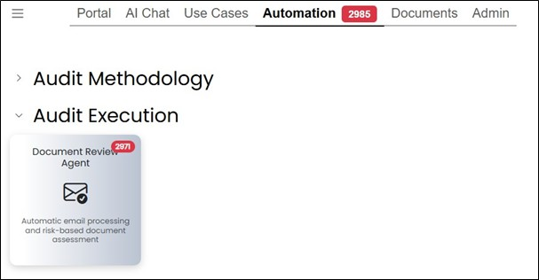
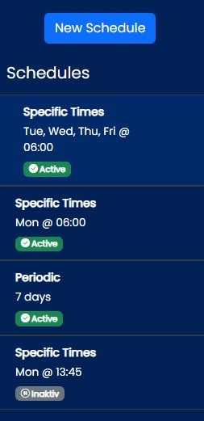
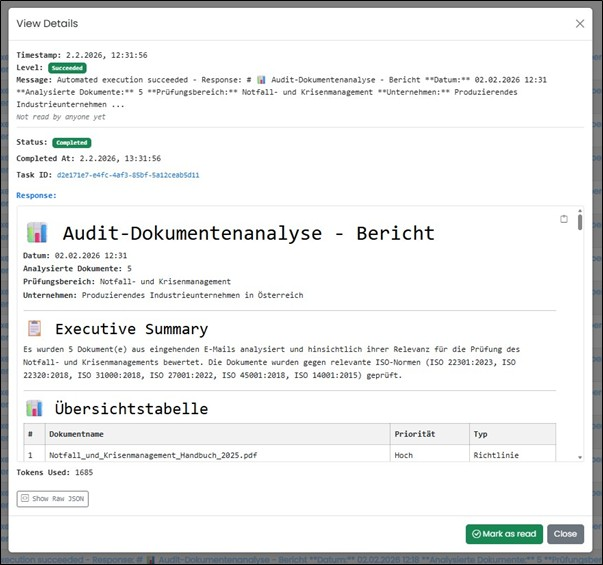

===== Audit Execution

In this section, if you have the necessary authorization, all automated provided agents are listed and managed.
The highlighted number (red) shows the number of current results from the latest run. If a user sets the read confirmation,
the display of still new results (red) is recalculated.

The following agents are implemented:

- Document Check Agent (Automatic email processing and risk-based document evaluation)

To open an agent, click on the icon with the name.
An overview displays all saved schedules. New schedules can be created here and existing ones can be deleted.

In the “Execution Logs” area, all program runs are listed. The read confirmation can be set in various ways.
If a user sets the read confirmation, the display of new feeds (red) is recalculated.
Blue text indicates an unread feed, black indicates a read feed. Each reader can mark the entry as read or mark it as unread again.

image::../images/Abbildung-28.jpg[Navigation area - Automation - Agents - protocols, title="Navigation area - Automation - Agents - protocols", width=400]

This read marking can be set in the overview or in the detail dialog. Detailed information can be viewed via a button.

