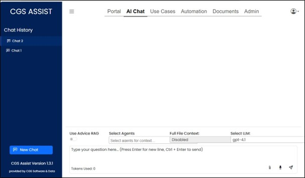
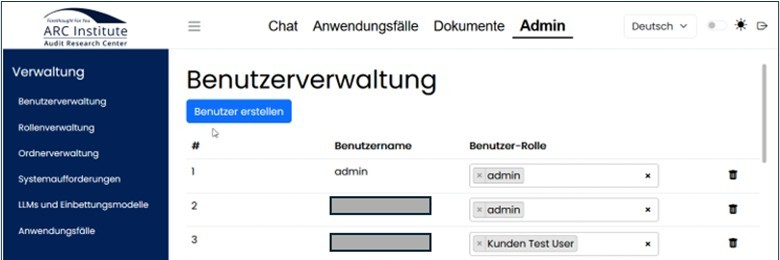
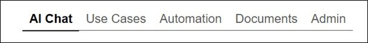
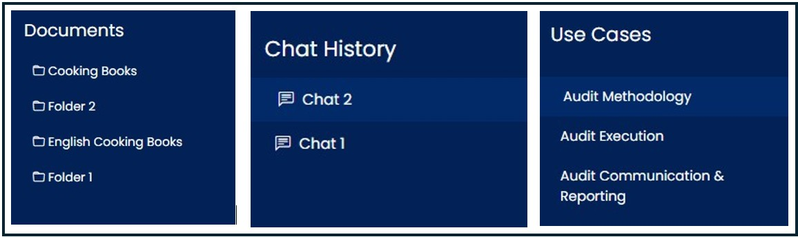
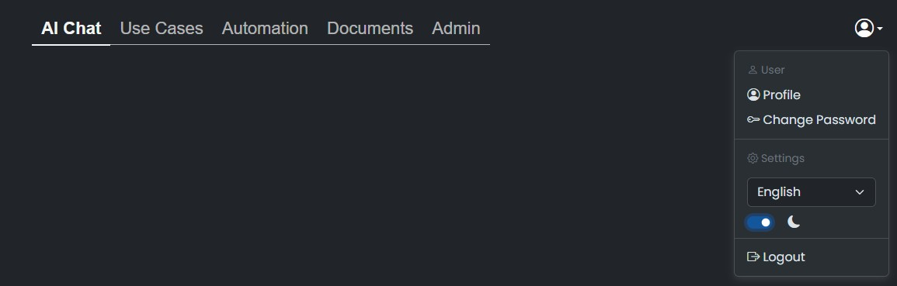
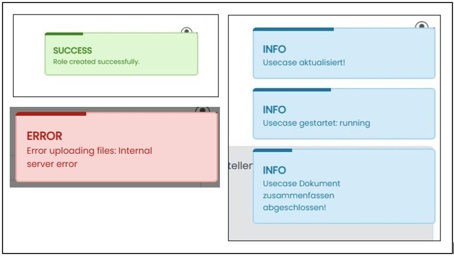

=== Description 

{application} provides a powerful AI platform that enables organizations to intelligently leverage their knowledge and convert it into productive outcomes. Through specialized chat interfaces and predefined use cases, employees gain fast and precise access to relevant company information—whether sourced from internal documents or cloud‑based repositories. {application} streamlines the analysis of complex content, simplifies the formulation of requests, and enables efficient data processing. In this way, artificial intelligence becomes a true driver of productivity in everyday work.

Upon first login, users are informed that the application uses artificial intelligence to automatically generate content. The output is based on probabilities and may contain errors. Users are therefore asked to carefully review all results. This notice must be acknowledged before continuing to use the assistant.

image::../images/Abbildung-confirm.jpg[Navigation - KI confirmation, title="Navigation - KI confirmation", width=500]

Certain recurring use cases are available as templates within Assist to simplify routine tasks. These use cases are designed like checklists. With the appropriate permissions, automated and scheduled queries can be created based on automatically supplied information sources (feeds).

ifeval::[{cgs-assist} == 1]

endif::[]

ifeval::[{arc-assist} == 1]

endif::[]

The thematic navigation areas can be accessed via the navigation bar at the top of the interface. Depending on user permissions, both the number of menu items and their design may vary.

Subpages within these navigation areas can then be accessed via the tree navigation on the left side.

A menu in the upper right corner allows users to select the application language, switch between light and dark mode, view their user profile, and change their password.

Throughout the application, colored notification dialogs appear in the upper left corner when actions are performed. +
The colors indicate the notification level:

|===
|green	| Successful execution
|blue	| General information
|red	| Error during execution
|===

