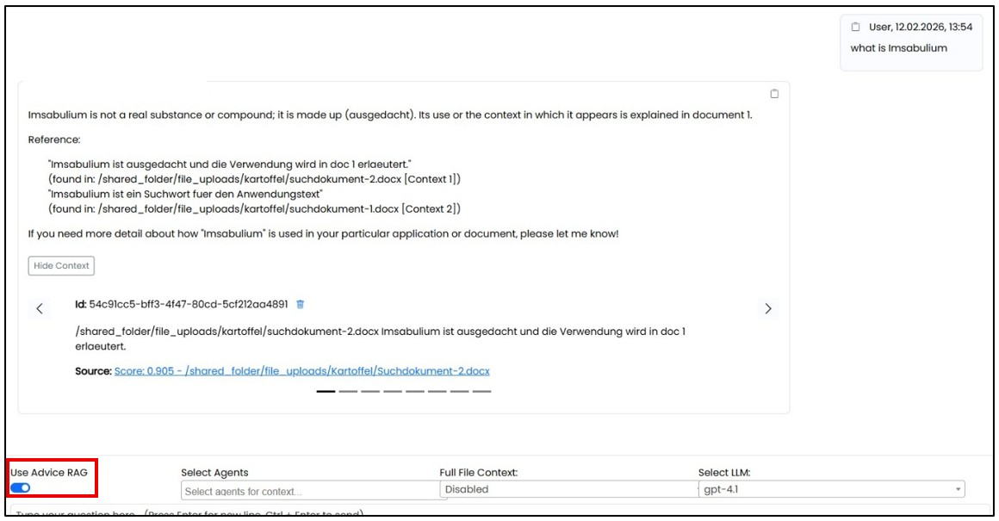
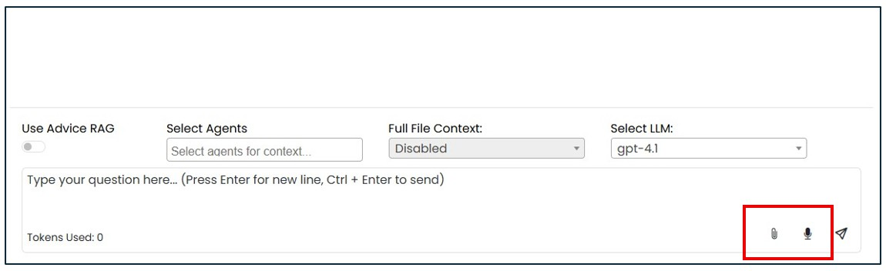
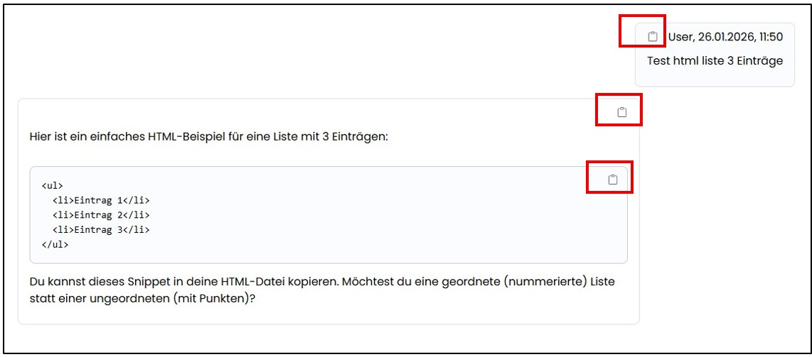
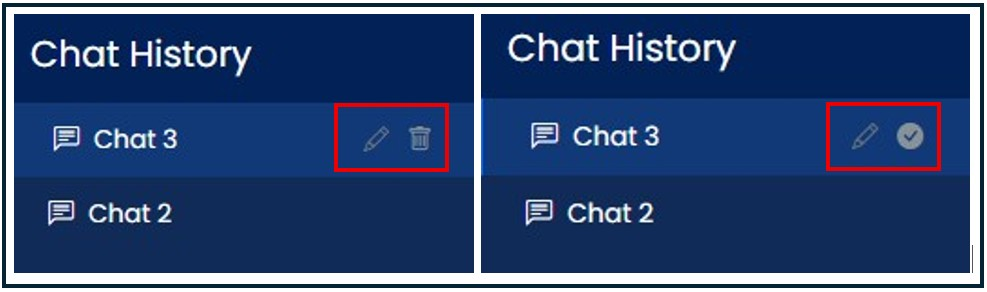

=== {application} Application

ifeval::[{cgs-assist} == 1]
==== Navigation Area "KI Chat"
endif::[]

ifeval::[{arc-assist} == 1]
==== Navigation Area "AI Chat"
endif::[]

This page provides a classic chat interface with an input field for prompts. All chat histories are stored only in the browser’s local storage. They are removed after closing the browser if the "automatic cache clearing" setting is enabled. All saved use case histories remain available even after closing and logging in again.

Before executing a request, you can select whether internal RAG content (e.g., documents from SharePoint or the database) should also be searched in addition to the general knowledge base.

A drop‑down menu allows you to choose from various agents for executing the query. These agents ensure that AI use within the organization is safe, structured, and controlled. They define exactly what the AI is allowed to do and provide transparent access boundaries to data and systems. The AI can only access the data explicitly permitted by the selected agent (e.g., “search” but not “delete”). Unrestricted access to company systems is not possible.

Folder‑level permissions and document‑level access rights are respected when using the RAG. When RAG is enabled, the answer displays the top eight embeddings used for generating the response, including a link to the respective source. This allows users to verify information with a single click.

*Supported document formats* for use in the AI Chat are: .pdf, .docx, .xlsx, .pptx, .txt.

 
An automatic spell checker is enabled. You can submit a request by typing text, using voice input via a microphone, or uploading a document.

Generated content can be copied to the clipboard using the “Copy” button.

Chats can be renamed using the edit (pencil) button. To delete a chat, click the delete icon in the tree menu and confirm the deletion by clicking the checkmark.

