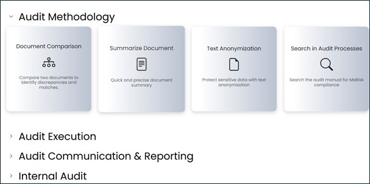
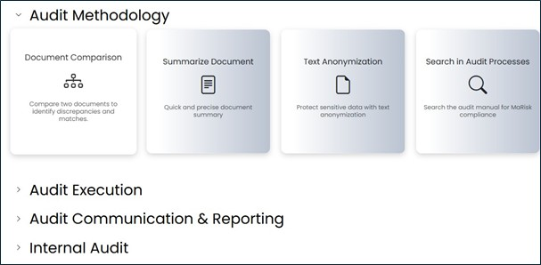
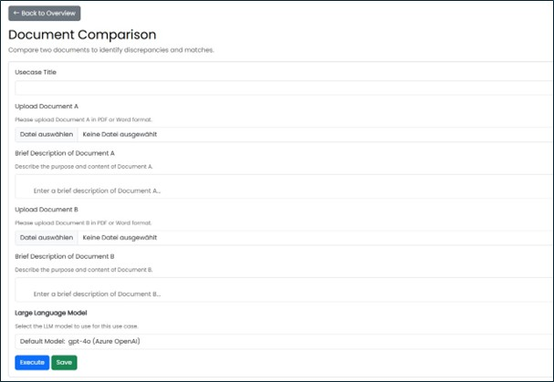
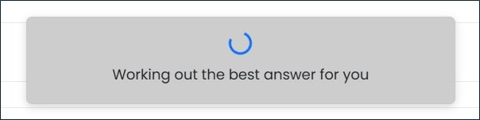
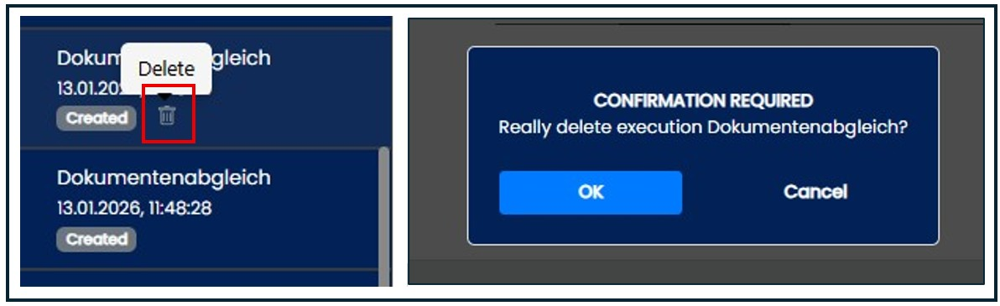

==== Navigation Area "Use Cases" 

All activated use cases are displayed here, grouped by category. Assignment of use cases to categories is configured in the administration area. Use cases are predefined templates that only need to be filled with specific information before execution. They simplify routine tasks.

Use cases that must be executed in a defined sequence can also be displayed in a workflow‑based manner. A dependent use case becomes available only after its prerequisite has been completed.

*Supported document formats* for use cases are: .pdf, .docx, .xlsx, .pptx, .txt.

To open a specific use case, click on the icon with the name.

To open a specific use case, click its corresponding icon. 

After filling in the required fields, the request can be executed by clicking “Execute.” A loading dialog appears while processing, and status updates are displayed.

After receiving the result, a button allows you to open the AI Chat to perform follow‑up queries related to the use case. Results can be saved and will then appear as separate chats. To delete a use case, click the delete button and confirm the action with “OK.”

