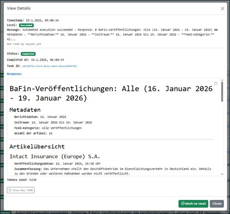

==== Navigation Area "Automation"

All automated agent use cases are listed and managed here, provided you have the necessary permissions.
These agent use cases are application cases defined in the administration that have been approved for automation.
The highlighted number (in red) shows the total number of current results from the most recent run across all categories.
The display of the results (in red) is recalculated when a user sets the read confirmation in any of the categories.

For each agent use case, it can be specified whether the tasks are to be executed at specific times or on a recurring basis.
Both options can be configured in detail here. In addition, you can check here whether the agents have successfully completed their tasks.

In the lower section, Execution Logs, all program runs are listed. The results can be viewed here in detailed views.

image::../images/Abbildung-28.jpg[Navigationsbereich - Automation, title="Navigation Area - Automation - Feeds", width=400]

To open an agent use case, click on the icon with the corresponding name.
The read confirmation can be set in several ways. When a user sets the read confirmation, the display of new queries (in red) is recalculated.
Blue text indicates an unread query, while black text indicates a read query.
Each reader can mark the entry as read or unread. Additionally, using the "I have also read this" button, the user can mark an entry that has already been set as "read" by someone else as "read by me."
The read marking can be set either in the overview or in the detail dialog.

