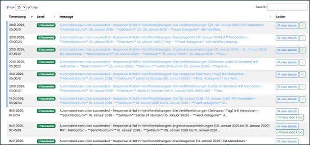
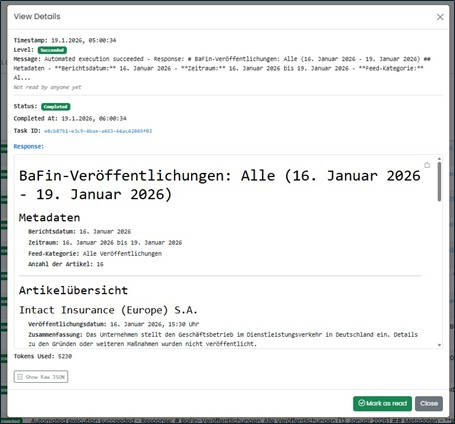

==== Navigation Area "Automation"

This area lists and manages all automated agent‑based use cases, provided the user has the necessary permissions. These automated use cases are defined in the administration and approved for automation.

The highlighted number (in red) shows the total count of new results from the most recent run across all categories. This number is recalculated whenever a user marks an item as read.

For each automated use case, you can configure whether tasks are executed at specific times or at recurring intervals. Additionally, you can monitor whether the agents have successfully completed their tasks.

In the “Execution Logs” section, all program runs are listed, and detailed views of the results can be opened.

To open an automated use case, click the icon with its name. Read confirmations can be set in several ways.
Blue text indicates unread entries; black text indicates read entries.
Users can mark entries as read or unread. The “I have also read this” button allows users to confirm they have read an entry already marked as read by someone else. Read status can be set either in the overview or in the detail dialog.

