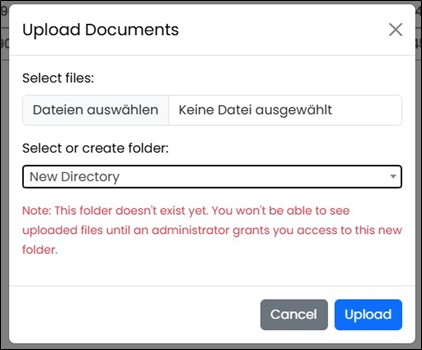

====  Navigation Area "Documents" 

All available and searchable documents for which the user is authorized according to their role are displayed here.
The document table can be filtered by document type (e.g., PDF, Excel, etc.), by source (e.g., network drive or SharePoint), or by content.
All documents are linked with keywords and can search by any keywords in the content field to find the relevant documents.

image::../images/Abbildung-12.jpg[Navigation area Documents - delete in tree, title="Navigation area Documents - delete in tree", width=400]

In the tree navigation, only the folders to which the user is authorized are listed. The assignment of documents to the respective 
folders takes place during upload or when folder are created via upload.

All documents are always displayed. When a folder is clicked, the view is filtered to show only the documents in that folder. 
If the folder is clicked again, the filtered view is reset to display all documents.

image::../images/Abbildung-33.jpg[Navigation area Documents - tree navigation, title="Navigation area Documents - tree navigation", width=150]

The documents can be downloaded via a button, and the view can be manually refreshed. New documents can be uploaded to the RAG using an upload function, 
the RAG can be updated via the refresh button, or individual documents can be deleted. Since processing a large number of documents can cause delays, 
lazy-loading has been implemented. This allows individual embeddings, i.e., document segments, to be manually reloaded using the reload icon.

When uploading documents, a folder must be selected, or a new folder can be created by entering a name. 
When creating a new folder, the user is notified by a red message that the new folder does not yet have any permissions. 
These permissions must be assigned in the administration section so that the new folder, including its documents, is visible.

  
At the top, there are filters to limit the number of results and sorting options by source, ID, and preview. The filter results update as you type. 
Documents, and thus the contents of the RAG, can be edited using an icon.

|===
|image:../images/Abbildung-34.jpg[Download File, width=30]| Download File
|image:../images/Abbildung-35.jpg[Load Embeddings, width=30]| Load Embeddings(single load)
|image:../images/Abbildung-36.jpg[Remove from RAG system (document remains in the folder structure), width=30] | Remove from RAG system (document remains in the folder structure)
|image:../images/Abbildung-37.jpg[Permanently delete document, width=30]| Permanently delete document
|===

By clicking the icon in front of the document, the partial documents can be displayed.

image::../images/Abbildung-13.jpg[[Navigation area Documents - partitial dokuments show, title="[[Navigation area Documents - partitial dokuments show", width=400]

