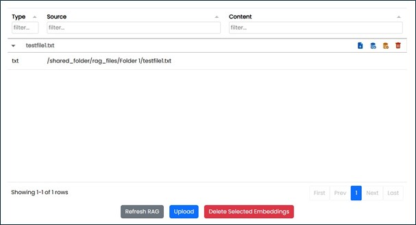
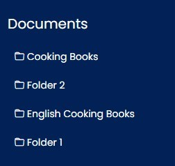
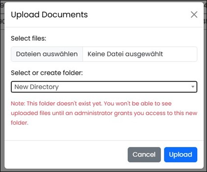
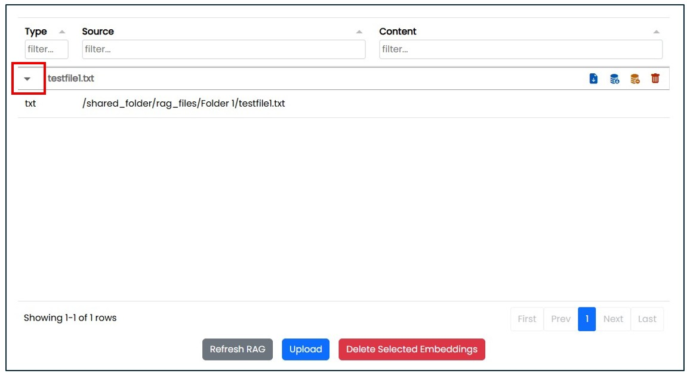

====  Navigation Area "Documents" 

This area displays all documents for which the user is authorized according to their assigned role. The table can be filtered by document type (e.g., PDF, Excel), by source (network drive or SharePoint), or by content. All documents are associated with keywords and can be found using keyword searches in the content field.

In the tree navigation, only folders for which the user has access permissions are displayed. Folder assignment is set during upload or when new folders are created.

Documents are always visible in the main view. When a folder is selected, the view is filtered to show only its contents. Selecting the folder again resets the filter.

Documents can be downloaded, and the view can be manually refreshed. New documents can be uploaded to the RAG via the upload function. The RAG can be refreshed manually, and individual documents can be deleted. Because processing a large number of documents may take time, lazy loading is implemented. Individual embeddings can be reloaded manually using the reload icon.

When uploading documents, a folder must be selected. New folders can be created by entering a name. When creating a new folder, a red message informs the user that the folder currently has no assigned permissions. These must be set in the administration area before the new folder and its documents become visible.

  
Filters at the top allow users to limit the number of results and sort by source, ID, or preview. Results update dynamically while typing. Documents—and thus the content shown to the RAG—can be edited using the corresponding icon.

|===
|image:../images/Abbildung-34.jpg[Download File, width=30]| Download File
|| Load Embeddings(single load)
| | Remove from RAG system (document remains in the folder structure)
|| Permanently delete document
|===

By clicking the icon next to a document, the associated partial documents are displayed.

