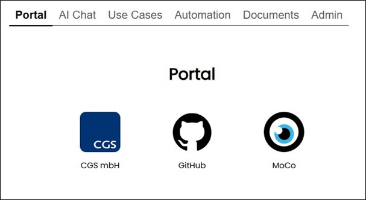

==== Navigation Area "Portal"

This page, and the corresponding menu entry, can be enabled or disabled in the administration. If enabled, all links configured in the administration and available to the current user are displayed here.

Clicking an icon opens the link in a new browser tab or window, depending on browser settings.

