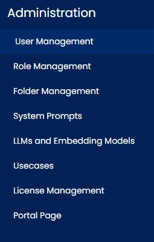

=== Assist Administration

Within Assist Administration, there is the possibility to centrally manage all system-relevant data. Here, users and roles, 
the document storage folders (RAG), interface configurations, system prompts, licenses, and the system-side 
stored use cases can be managed.
Access to these administration functions is granted via a system-defined, pre-configured role.

==== User Management

Here, users can be created and edited. 

image::../images/Abbildung-16.jpg[Administration - User Management, title="Administration - User Management", width=400]

===== Edit User

When creating a user, a system-wide unique username must be assigned. This is used case sensitive during login. 
Subsequent changes to the username are not possible.
In addition, a name, a password must be assigned and a role must be given to the user. The assigned role can be changed at any time.
User name editing or changing ist not possible.If an assigned role is deleted, it is also removed from the associated users.

image::../images/Abbildung-17.jpg[Administration - User Management - create user, title="Administration - User Management - create user", width=400]

Users cannot be deactivated and can only be removed in the overview table after a confirmed security prompt.

