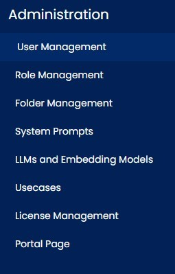
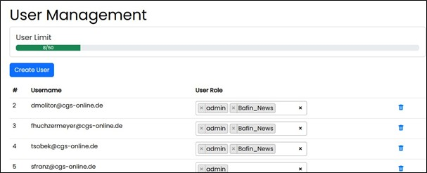

=== Assist Administration

Within Assist Administration, all system‑relevant data can be centrally managed. This includes user and role management, document storage folders (RAG), interface configurations, system prompts, licenses, and the system‑stored use cases. Access to administrative functions is granted via a system-defined, preconfigured role.

==== User Management

The availability of user management options depends on the configured authentication method.

*OpenID Connect/SAML (Microsoft Entra ID)*

* Adding or editing users via the CGS Assist interface is *not* possible.
* Password management is handled through Microsoft.
* Role assignment for CGS Assist is possible via the CGS Assist interface.
* Users can only be removed from the CGS Assist overview after confirming a security prompt. After logging in again, the data will be synchronized, and the user may reappear in the system.

*Local User/Password Management*

* Adding and editing users via the CGS Assist interface is possible.
* Passwords can be managed directly in the CGS Assist interface.
* Role assignment for CGS Assist is possible via the CGS Assist interface.
* Users can be removed from the overview after confirming a security prompt.

