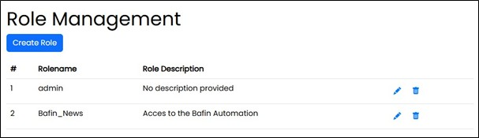

==== Role Management

On this site, roles can be created and edited. 

===== Edit Role

When creating a new role, a system-wide unique role name must be assigned. Each role can have a description. 
The name and the description can be changed at any time.

image::../images/Abbildung-19.jpg[Administration - Role Management - edit role, title="Administration - Role Management - edit role", width=400]

Roles cannot be deactivated and can only be removed in the overview table after a confirmed security prompt.
System-defined roles cannot be deleted.

