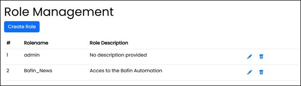
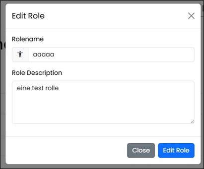

==== Role Management

Roles can be created and edited on this page. When creating a new role, a system‑wide unique role name must be assigned. Each role may also include a description. Both the name and description can be changed at any time.

Roles cannot be deactivated and can only be removed from the overview after confirming a security prompt. System‑defined roles cannot be deleted.

