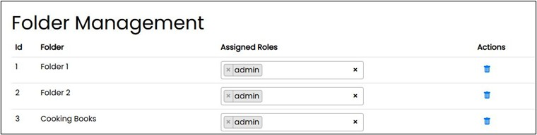

==== Folder Management

On this site, roles can be assigned to the folders created by the system. This controls access to these folders under the "Documents" navigation area.
A folder corresponds in the application to a RAG (Retrieval Augmented Generation). With Retrieval Augmented Generation, you extend the prompt for the Large Language Model 
with search results, e.g., from the document collection. Therefore, the knowledge for the answer comes from the connected sources.

The document formats permitted by the system for use in the folder management are: .pdf, .docx, .xlsx, .pptx, and .txt.

