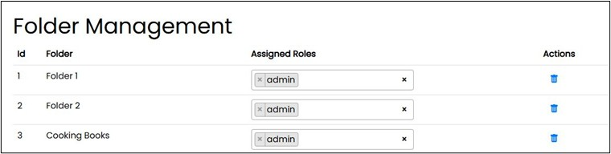

==== Folder Management

This page displays all created folders. Permissions for these folders can be assigned through roles. These permissions control the visibility and accessibility of folders within the “Documents” navigation area.

*Supported document formats* in folder management are: .pdf, .docx, .xlsx, .pptx, .txt.

