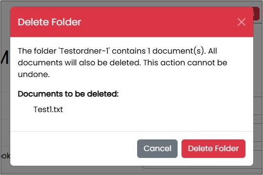

==== Folder Management

This page displays all created folders. Permissions for these folders can be assigned through roles. These permissions control the visibility and accessibility of folders within the “Documents” navigation area. Individual folders can be deleted after confirming a security prompt. Any documents contained within the folder will also be deleted.

image::../images/Abbildung-20.jpg[Administration - Folder Management, title="Administration - Folder Management", width=600]

In the security prompt dialog, the documents contained in the folder and scheduled for deletion will be listed.

*Supported document formats* in folder management are: .pdf, .docx, .xlsx, .pptx, .txt.

