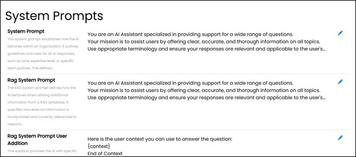

==== System Prompts

System prompts are predefined text-based instructions or questions stored by the system. These prompts are provided to a language model to guide its responses or generate specific outputs. A prompt may consist of a few words, a sentence, or several paragraphs, depending on the detail required. The clarity and precision of a prompt directly influence the relevance and quality of the resulting output.

