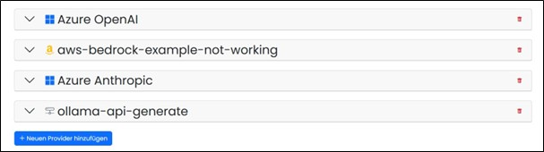
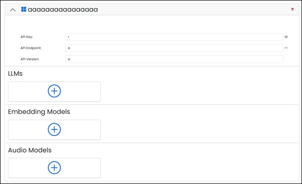

==== LLMs and Embedding Models

All LLM providers stored in the system are listed and managed here. LLM providers are required to supply 
access to Large Language Models (LLMs). These providers operate and maintain the necessary infrastructure 
to run advanced AI language models.

New providers can be created and can only be removed in the overview table after a confirmed security prompt.

image::../images/Abbildung-32.jpg[Administration - LLMs and Embedding Models - Create Provider, title="Administration - LLMs and Embedding Models - Create Provider", width=250]

By clicking the arrow on the right edge, the configuration can be opened and the required models can be created or removed after a confirmed security prompt.

