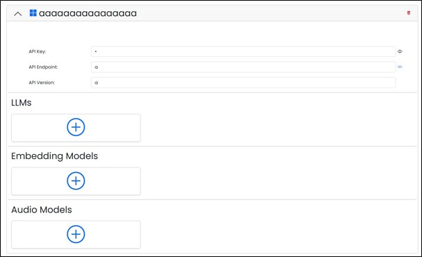

==== LLMs and Embedding Models

All LLM providers stored in the system are listed and managed here. These providers supply access to Large Language Models (LLMs) and maintain the infrastructure required to operate advanced AI language models.

image::../images/Abbildung-22.jpg[Administration - LLMs and Embedding Models, title="Administration - LLMs and Embedding Models", width=400]

New providers can be created and can only be removed from the overview after confirming a security prompt.

image::../images/Abbildung-32.jpg[Administration - LLMs and Embedding Models - Create Provider, title="Administration - LLMs and Embedding Models - Create Provider", width=250]

By clicking the arrow on the right, the provider configuration can be opened, and required models may be created or removed (removal also requires a confirmed security prompt).

