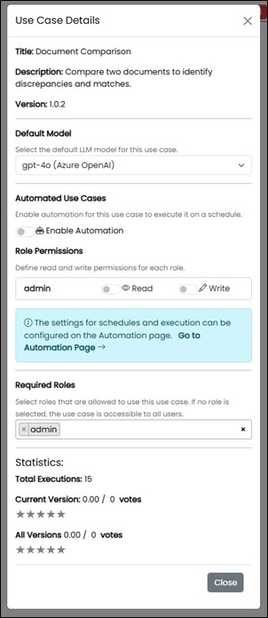

==== Use Cases

Here, concrete use cases or templates for them are stored. Use Cases are templates for ready-made routines like checklists to make recurring, use-case-organized requests. 
The grouping of the use cases is defined by the system and is reused under the navigation area "Use Cases".

image::../images/Abbildung-25.jpg[Administration - Use Cases, title="Administration - Use Cases", width=400]

Stored templates can be deactivated. This controls the visibility/availability under "Use Cases" in the navigation.

A use case or template can be activated for automation (AI agent). Additionally, permissions must be set. 
Afterwards, it will be visible to authorized users under the "Automation" navigation area and can be configured for scheduled executions.
Additionally, statistics for the evaluation of the use case are displayed, such as the number of stars given in the ratings.

