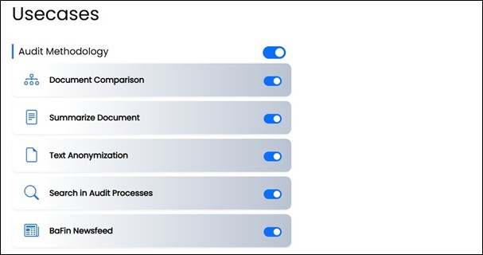
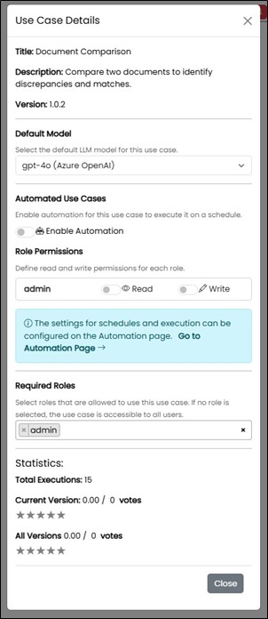

==== Use Cases

This section contains all stored use cases or templates. Use cases function as templates for predefined routines, such as checklists, that support recurring and structured requests. The grouping of use cases is defined by the system and reused in the “Use Cases” navigation area.

Use case templates can be deactivated to control their visibility.

A use case or template can also be activated for automation (AI agent). Required permissions must be set accordingly. Once activated, the automated use case appears in the “Automation” navigation area, where it can be configured for scheduled execution.

Statistics—such as user ratings and the number of stars—are displayed for evaluation purposes.

