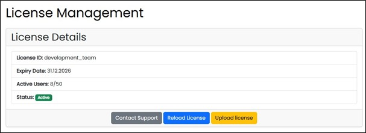
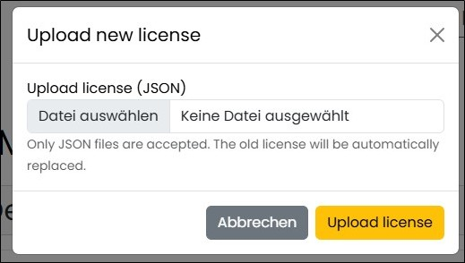

==== License Management

This page allows you to manage the license required to operate the CGS Assist application. Licenses can be updated if an existing license has been replaced.

You can also contact CGS Assist support by email using the integrated button. Clicking it opens your default email client with the recipient field pre-filled.

A completely new license file can be uploaded after selecting it.

