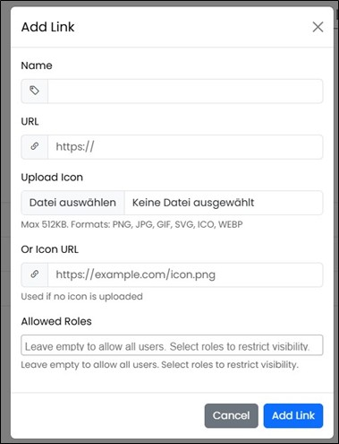

==== Portal Page

On this page, various links can be managed. You have the option to create new entries, delete, or edit individual items. 
The availability of specific links can be controlled via separate permissions.
Additionally, the entire portal page can be activated or deactivated, and it will then no longer be available in the navigation.

image::../images/Abbildung-41.jpg[Administration - Portal page, title="Administration - Portal page", width=400]

Pages or applications can be linked. Linking documents on drives or shares is not possible.

