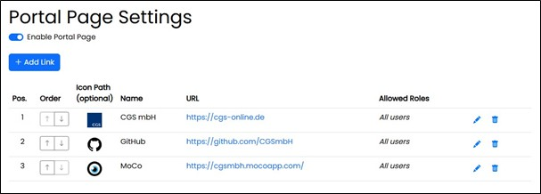
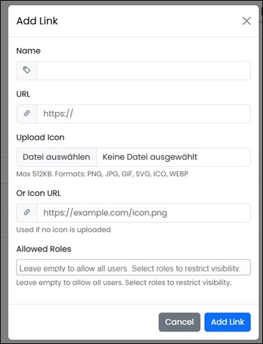

==== Portal Page

This page allows management of various external links. You can create new entries, edit existing ones, or delete individual items. The availability of each link can be controlled through permissions.

Additionally, the entire portal page can be activated or deactivated. When deactivated, it will no longer appear in the navigation.

Pages or applications can be linked, but documents stored on drives or network shares cannot be linked here.

